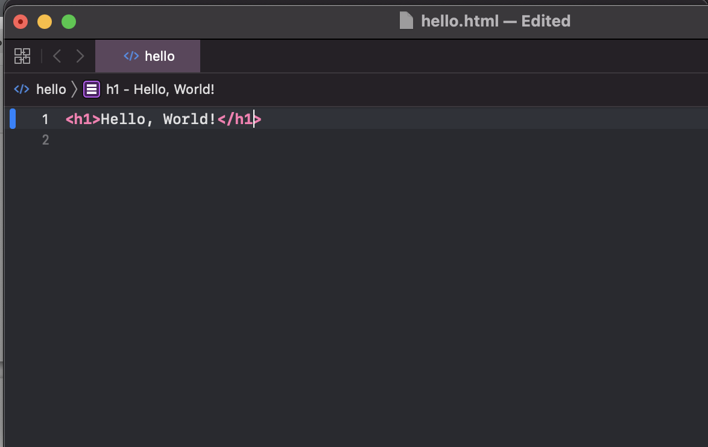
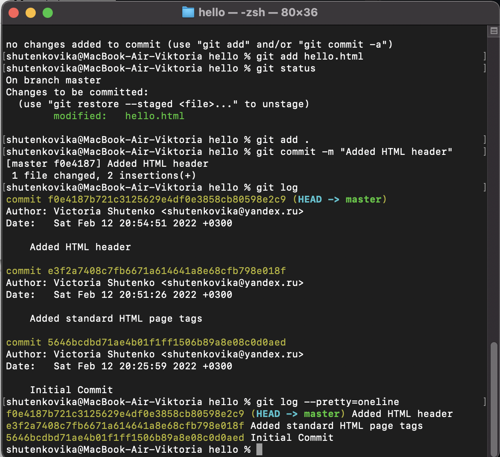
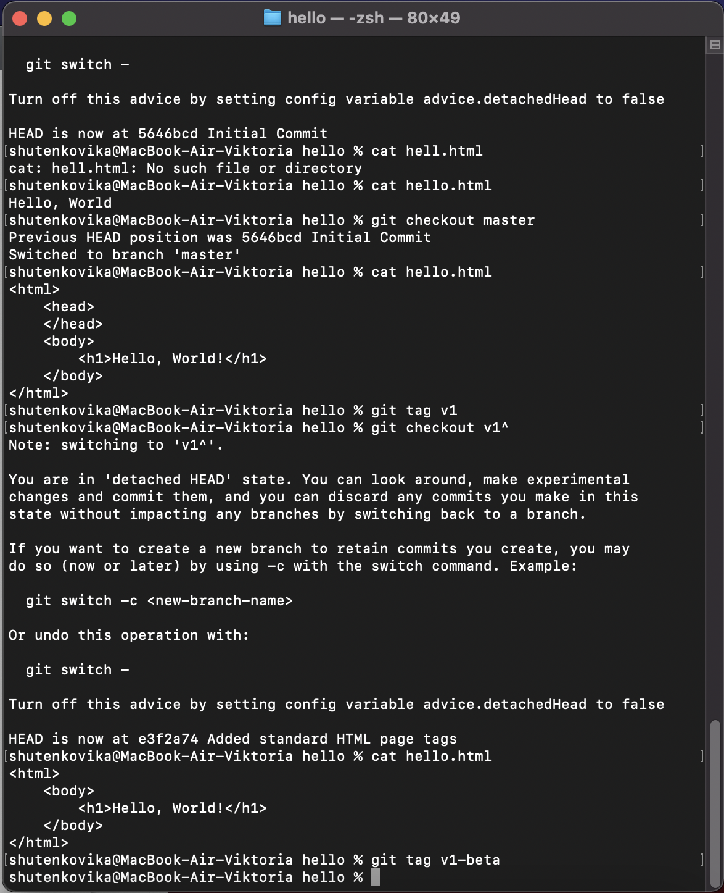
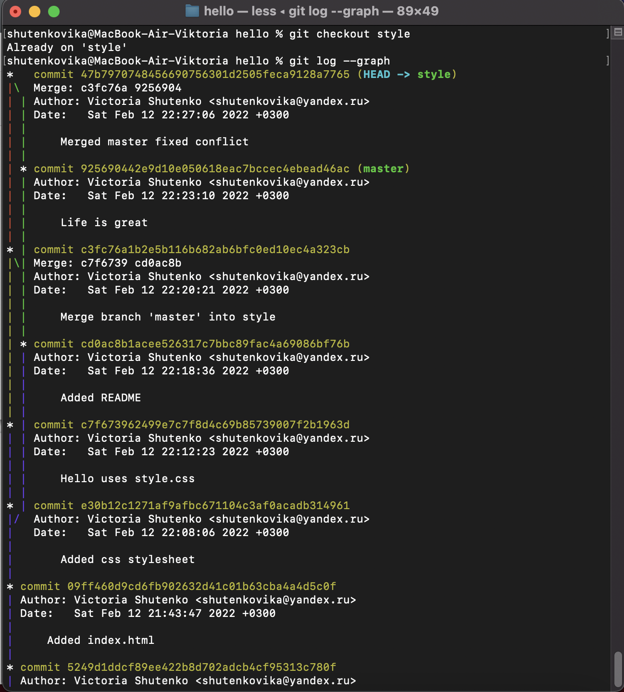
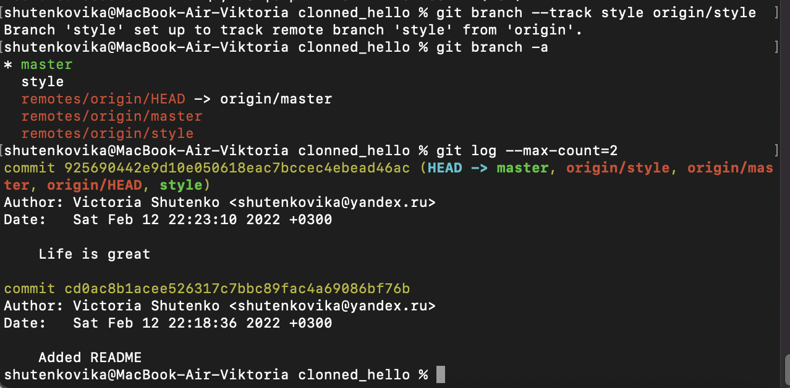
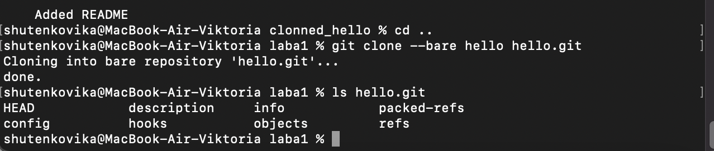
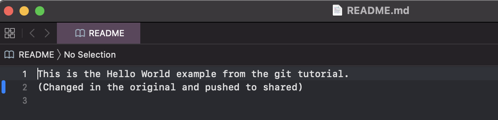

---
# Front matter
title: "отчёт по лабораторной работе №1"
subtitle: "Работа с git"
author: "Виктория Михайловна Шутенко"

# Generic otions
lang: ru-RU
toc-title: "Содержание"

# Bibliography
bibliography: bib/cite.bib
csl: pandoc/csl/gost-r-7-0-5-2008-numeric.csl

# Pdf output format
toc: true # Table of contents
toc_depth: 2
lof: true # List of figures
lot: true # List of tables
fontsize: 12pt
linestretch: 1.5
papersize: a4
documentclass: scrreprt
## I18n
polyglossia-lang:
  name: russian
  options:
	- spelling=modern
	- babelshorthands=true
polyglossia-otherlangs:
  name: english
### Fonts
mainfont: PT Serif
romanfont: PT Serif
sansfont: PT Sans
monofont: PT Mono
mainfontoptions: Ligatures=TeX
romanfontoptions: Ligatures=TeX
sansfontoptions: Ligatures=TeX,Scale=MatchLowercase
monofontoptions: Scale=MatchLowercase,Scale=0.9
## Biblatex
biblatex: true
biblio-style: "gost-numeric"
biblatexoptions:
  - parentracker=true
  - backend=biber
  - hyperref=auto
  - language=auto
  - autolang=other*
  - citestyle=gost-numeric
## Misc options
indent: true
header-includes:
  - \linepenalty=10 # the penalty added to the badness of each line within a paragraph (no associated penalty node) Increasing the value makes tex try to have fewer lines in the paragraph.
  - \interlinepenalty=0 # value of the penalty (node) added after each line of a paragraph.
  - \hyphenpenalty=50 # the penalty for line breaking at an automatically inserted hyphen
  - \exhyphenpenalty=50 # the penalty for line breaking at an explicit hyphen
  - \binoppenalty=700 # the penalty for breaking a line at a binary operator
  - \relpenalty=500 # the penalty for breaking a line at a relation
  - \clubpenalty=150 # extra penalty for breaking after first line of a paragraph
  - \widowpenalty=150 # extra penalty for breaking before last line of a paragraph
  - \displaywidowpenalty=50 # extra penalty for breaking before last line before a display math
  - \brokenpenalty=100 # extra penalty for page breaking after a hyphenated line
  - \predisplaypenalty=10000 # penalty for breaking before a display
  - \postdisplaypenalty=0 # penalty for breaking after a display
  - \floatingpenalty = 20000 # penalty for splitting an insertion (can only be split footnote in standard LaTeX)
  - \raggedbottom # or \flushbottom
  - \usepackage{float} # keep figures where there are in the text
  - \floatplacement{figure}{H} # keep figures where there are in the text

---

# Цель работы

Приобрести практические навыки при работе с git и markdown.

# Задание

- Сделайте отчёт по предыдущей лабораторной работе в формате Markdown.
- В качестве отчёта просьба предоставить отчёты в 3 форматах: pdf, docx и md (в архиве, поскольку он должен содержать скриншоты, Makefile и т.д.)

# Теоретическое введение


# Выполнение лабораторной работы

## 1.1 Подготовка

### 1.1.1 Установка имени и электронной почты

У меня git уже установлен, плэтому перешла к разделу окончания строк.

{ 	#fig:001 width=70% }

### 1.1.2 Параметры установки окончаний строк

Как пользователь Mac, для выполнения этого шага я использовала следующие команды:
```
git config --global core.autocrlf input
git config --global core.safecrlf true
```
{ 	#fig:001 width=70% }

### 1.1.3 Установка отображения unicode
По умолчанию, git должен был печатать не-ASCII символов в именах файлов в виде
восьмеричных последовательностей. Что бы избежать нечитаемых строк, я
установила соответствующий флаг.
```
git config --global core.quotepath off
```
{ 	#fig:001 width=70% }

## 1.2 Создание проекта
### 1.2.1 Создайте страницу «Hello, World»

Я начала работу в пустом рабочем каталоге с создания пустого каталога с именем
hello, затем вошла в него и создала там файл с именем hello.html.
```
mkdir hello
cd hello
touch hello.html
echo "Hello, World!" > hello.html\
```
{ 	#fig:001 width=70% }

### 1.2.2 Создание репозитория
Чтобы создать git репозиторий из этого каталога, я выполнила команду git init.
```
git init
```
{ 	#fig:001 width=70% }

### 1.2.3 Добавление файла в репозиторий
Добавила файл в репозиторий.
```
git add hello.html
git commit -m "Initial Commit"
```
{ 	#fig:001 width=70% }

### 1.2.4 Проверка состояние репозитория
Использовала команду git status, чтобы проверить текущее состояние репозитория.
```
git status
```
{ 	#fig:001 width=70% }

## 1.3 Внесение изменений
### 1.3.1 Измените страницу «Hello, World»

Добавила кое-какие HTML-теги к нашему приветствию. Изменила содержимое
файла hello.html на:
```
<h1>Hello, World!</h1>
```
Проверила состояние рабочего каталога.
```
git status
```
{ 	#fig:001 width=70% }

{ 	#fig:001 width=70% }

## 1.4 Индексация изменений
Теперь выполнила команду git, чтобы проиндексировать изменения. Проверила
состояние.
```
git add hello.html
git status
```
{ 	#fig:001 width=70% }

### 1.4.1 Коммит изменений

Сделала коммит и проверила состояние.
```
git commit
```
Открылся редактор.
В первой строке ввела комментарий: «Added h1 tag».
Сохранила файл и вышла из редактора (для этого в редакторе по-умолчанию (Vim) я нажала
клавишу ESC, ввела :wq и нажала Enter).
Потом еще раз проверила состояние.
```
git status
```
Рабочий каталог чистый, продолжила работу.

{ 	#fig:001 width=70% }

### 1.4.2 Добавьте стандартные теги страницы
Изменила страницу «Hello, World», чтобы она содержала стандартные теги ```<html>```
и ```<body>```.
```
<html>
<body>
<h1>Hello, World!</h1>
</body>
</html>
```
{ 	#fig:001 width=70% }

Теперь добавила это изменение в индекс git.
```git add hello.html
```
Теперь добавила заголовки HTML (секцию ```<head>```) к странице «Hello, World».

```
<html>
<head>
</head>
<body>
<h1>Hello, World!</h1>
</body>
</html>
```
{ 	#fig:001 width=70% }
Проверила текущий статус:
```
git status
```
Произвела коммит проиндексированного изменения (значение по умолчанию), а затем еще раз проверила состояние.
```
git commit -m "Added standard HTML page tags"
git status
```
Состояние команды говорит о том, что hello.html имеет незафиксированные
изменения, но уже не в буферной зоне.
Теперь добавила второе изменение в индекс, а затем проверьте состояние с
помощью команды git status.
```
git add .
git status
```
В качестве файла для добавления, я использовали текущий каталог (.). Это
краткий и удобный путь для добавления всех изменений в файлы текущего каталога
и его подкаталоги. Но поскольку он добавляет все, не лишним будет проверить
состояние перед запуском add, просто чтобы убедиться, что я не добавила какой-то файл, который добавлять было не нужно.
Второе изменение было проиндексировано и готово к коммиту.
Сделала коммит второго изменения
```
git commit -m "Added HTML header"
```
{ 	#fig:001 width=70% }

### 1.4.3 История
Получила список произведенных изменений:
```
git log
```
Однострочный формат истории:
```
git log --pretty=oneline
```
Есть много вариантов отображения лога.
```
git log --pretty=oneline --max-count=2
git log --pretty=oneline --since='5 minutes ago'
git log --pretty=oneline --until='5 minutes ago'
git log --pretty=oneline --author=<your name>
git log --pretty=oneline --all
```
{ 	#fig:001 width=70% }

{ 	#fig:001 width=70% }

Справочная страница:
```
man git-log
```
Инструмент gitk полезен в изучении истории изменений.

{ 	#fig:001 width=70% }

### 1.4.4 Получение старых версий
Возвращаться назад в историю очень просто. Команда checkout скопирует любой
снимок из репозитория в рабочий каталог.
Получила хэши предыдущих версий
```
git log
```
Изучила данные лога и нашла хэш для первого коммита. Он должен был быть в
последней строке данных. Использовала этот хэш-код (достаточно первых 7 знаков)
В соем случае это 5646bcd...
в команде ниже. Затем проверила содержимое файла hello.html.
```
git checkout <hash>
cat hello.html
```
Вернулась к последней версии в ветке master
```
git checkout master
cat hello.html
```
master — имя ветки по умолчанию. Переключая имена веток,  я попадаю на
последнюю версию выбранной ветки.

{ 	#fig:001 width=70% }

{ 	#fig:001 width=70% }

### 1.4.5 Создание тегов версий
Назвала текущую версию страницы hello первой (v1).
Создала тег первой версии
```
git tag v1
```
Теперь текущая версия страницы называется v1.
Cоздадала тег для версии, которая идет перед текущей версией и назвала его v1-beta. В первую очередь мне надо было переключиться на предыдущую версию. Вместо поиска до хэш, я использовала
^, обозначающее «родитель v1». Вместо обозначения v1^ я использовала v1~1. Это обозначение можно определить как «первую версию предшествующую
v1».
```
git checkout v1^
cat hello.html
```
Это версия c тегами <html> и <body>, но еще пока без <head>. Потом сделала
ее версией v1-beta.
```
git tag v1-beta
```
{ 	#fig:001 width=70% }

### 1.4.6 Переключение по имени тега
Потом попробовала попереключаться между двумя отмеченными версиями.
```
git checkout v1
git checkout v1-beta
```
{ 	#fig:001 width=70% }

### 1.4.7 Просмотр тегов с помощью команды tag
Потом я увидела, какие теги доступны, используя команду git tag.
```
git tag
```
Я также смогла посмотреть теги в логе.
```
git log master --all
```

{ 	#fig:001 width=70% }

## 1.5 Отмена локальных изменений (до индексации)

### 1.5.1 Переключитесь на ветку master
Убедилась, что я находитесь на последнем коммите ветки master, прежде чем
продолжить работу.
```
git checkout master
```
{ 	#fig:001 width=70% }

### 1.5.2 Измените hello.html
Внесла изменение в файл hello.html в виде нежелательного комментария.
```
<html>
<head>
</head>
<body>
<h1>Hello, World!</h1>
<!-- This is a bad comment. We want to revert it. -->
</body>
</html>
```
{ 	#fig:001 width=70% }

### 1.5.3 Проверьте состояние
Сначала проверила состояние рабочего каталога.
```
git status
```
Я заметила, что файл hello.html был изменен, но еще не проиндексирован.

{ 	#fig:001 width=70% }

### 1.5.4 Отмена изменений в рабочем каталоге
Использовала команду git checkout для переключения версии файла
hello.html в репозитории.
```
git checkout hello.html
git status
cat hello.html
```
{ 	#fig:001 width=70% }

## 1.6 Отмена проиндексированных изменений (перед коммитом)

### 1.6.1 Измените файл и проиндексируйте изменения
Внесла изменение в файл hello.html в виде нежелательного комментария
```
<html>
<head>
<!-- This is an unwanted but staged comment -->
</head>
<body>
<h1>Hello, World!</h1>
</body>
</html>
```
{ 	#fig:001 width=70% }

Проиндексировала это изменение.
```
git add hello.html
```

### 1.6.2 Проверьте состояние
Проверила состояние нежелательного изменения.
```
git status
```
Состояние показывает, что изменение было проиндексировано и готово к коммиту.

### 1.6.3 Выполните сброс буферной зоны
Вывод состояния показал мне именно то, что я должны сделать
для отмены индексации изменения.
```
git reset HEAD hello.html
```

### 1.6.4 Переключитесь на версию коммита
```
git checkout hello.html
git status
```
Мой рабочий каталог опять чист.

{ 	#fig:001 width=70% }

## 1.7 Отмена коммитов

### 1.7.1 Отмена коммитов

### 1.7.2 Измените файл и сделайте коммит
Изменила файл hello.html на следующий.
```
<html>
<head>
</head>
<body>
<h1>Hello, World!</h1>
<!-- This is an unwanted but committed change -->
</body>
</html>
```
Выполнила:
```
git add hello.html
git commit -m "Oops, we didn't want this commit"
```
{ 	#fig:001 width=70% }

{ 	#fig:001 width=70% }

### 1.7.3 Сделайте коммит с новыми изменениями, отменяющими предыдущие
Чтобы отменить коммит, мне было необходимо сделать коммит, который удаляет изменения, сохраненные нежелательным коммитом.
```
git revert HEAD
```
Перешла в редактор, где я могу отредактировать коммит-сообщение по
умолчанию или оставить все как есть. Сохранила и закрыла файл.
Так как я отменила самый последний произведенный коммит, то я смогла
использовать HEAD в качестве аргумента для отмены. Но я могу и отменить любой
произвольной коммит в истории, указав его хэш-значение.

### 1.7.4 Проверьте лог
Проверка лога показывает нежелательные и отмененные коммиты в наш репозиторий.
```
git log
```
Эта техника будет работать с любым коммитом.

## 1.8 Удаление коммиттов из ветки
git revert является мощной командой, которая позволяет отменить любые коммиты в репозиторий. Однако, и оригинальный и «отмененный» коммиты видны в истории ветки (при использовании команды git log).

### 1.8.1 Команда git reset
При получении ссылки на коммит (т.е. хэш, ветка или имя тега), команда git
reset:
• перепишет текущую ветку, чтобы она указывала на нужный коммит;
• опционально сбросит буферную зону для соответствия с указанным коммитом;
• опционально сбросит рабочий каталог для соответствия с указанным коммитом.

### 1.8.2 Проверьте нашу историю
Cделала быструю проверку моей истории коммитов. Выполнила:
```
git log
```
### 1.8.3 Для начала отметьте эту ветку
Но прежде чем удалить коммиты, я отметила последний коммит тегом, чтобы
потом можно было его найти.
```
git tag oops
```
{ 	#fig:001 width=70% }

### 1.8.4 Сброс коммитов к предшествующим коммиту Oops
Глядя на историю лога, я заметила, что коммит с тегом «v1» является коммитом,
предшествующим ошибочному коммиту. Я сбросила ветку до этой точки.
Поскольку ветка имеет тег, я могу использовать имя тега в команде сброса
(если она не имеет тега, мы можем использовать хэш-значение).
```
git reset --hard v1
git log
```
Моя ветка master теперь указывает на коммит v1, а коммитов Oops и Revert
Oops в ветке уже нет. 

### 1.8.5 Ничего никогда не теряется

Я посмотрела на все коммиты.
```
git log --all
```
{ 	#fig:001 width=70% }

### 1.8.6 Опасность сброса
Сброс в локальных ветках, как правило, безопасен. Последствия любой «аварии»
как правило, можно восстановить простым сбросом с помощью нужного коммита.
Однако, если ветка «расшарена» на удаленных репозиториях, сброс может сбить с
толку других пользователей ветки.

## 1.9 Удаление тега oops

### 1.9.1 Удаление тега oops
Тег oops свою функцию выполнил. Я удалила его и коммиты, на которые он
ссылался, сборщиком мусора.
```
git tag -d oops
git log --all
```
Тег «oops» больше не будет отображаться в репозитории.

{ 	#fig:001 width=70% }

## 1.10 Внесение изменений в коммиты

### 1.10.1 Измените страницу, а затем сделайте коммит
Добавила в страницу комментарий автора (Шутенко).
```
<!-- Author: Viktoria M. Shutenko -->
<html>
<head>
</head>
<body>
<h1>Hello, World!</h1>
</body>
</html>
```
{ 	#fig:001 width=70% }

Выполнила:
```
git add hello.html
git commit -m "Add an author comment"
```
{ 	#fig:001 width=70% }

### 1.10.2 Необходим email
Обновила страницу hello, включив в нее email.
```
<!-- Author: Viktoria M. Shutenko (shutenkovika@yandex.ru) -->
<html>
<head>
</head>
<body>
<h1>Hello, World!</h1>
</body>
</html>
```
{ 	#fig:001 width=70% }

### 1.10.3 Измените предыдущий коммит
Изменила предыдущий коммит, включив в него адрес электронной почты.
Выполнила:
```
git add hello.html
git commit --amend -m "Add an author/email comment"
```
### 1.10.4 Просмотр истории
Выполнила:
```
git log
```
{ 	#fig:001 width=70% }

## 1.11 Перемещение файлов

### 1.11.1 Переместите файл hello.html в каталог lib
Далее, я занималась созданием структуры нашего репозитория. Перенесла страницу в каталог lib.
```
mkdir lib
git mv hello.html lib
git status
```
{ 	#fig:001 width=70% }

## 1.12 Второй способ перемещения файлов
Следующий набор команд идентичен моим последним действиям. Работы здесь побольше, но результат тот же.
Я могла бы выполнить:
```
mkdir lib
mv hello.html lib
git add lib/hello.html
git rm hello.html
```
### 1.12.1 Коммит в новый каталог
Cделала коммит этого перемещения:
```
git commit -m "Moved hello.html to lib"
```

## 1.13 Подробнее о структуре

###1.13.1 Добавление index.html
Добавила файл index.html в наш репозиторий
```
<html>
<body>
<iframe src="lib/hello.html" width="200" height="200" />
</body>
</html>
```
Добавила файл и сделала коммит.
```
git add index.html
git commit -m "Added index.html.
```
Теперь при открытии index.html, я могу увидеть кусок страницы hello в маленьком окошке.

{ 	#fig:001 width=70% }

{ 	#fig:001 width=70% }

## 1.14 Git внутри: Каталог .git
### 1.14.1 Каталог .git
Выполнила:
```
ls -C .git
```
Это каталог, в котором хранится вся информация git.

### 1.14.2 База данных объектов
Выполнила:
```
ls -C .git/objects
```
### 1.14.3 Углубляемся в базу данных объектов
Выполнила:
```
ls -C .git/objects/<dir>
```

### 1.14.4 Config File
Выполнила:
```
cat .git/config
```
Это файл конфигурации, создающийся для каждого конкретного проекта. Записи
в этом файле будут перезаписывать записи в файле .gitconfig вашего главного
каталога, по крайней мере в рамках этого проекта.

###1.14.5 Ветки и теги
Выполнила:
```
ls .git/refs
ls .git/refs/heads
ls .git/refs/tags
cat .git/refs/tags/v1
```

### 1.14.6 Файл HEAD
Выполнила:
```
cat .git/HEAD
```
Файл HEAD содержит ссылку на текущую ветку, в данный момент это должна
быть ветка master.

{ 	#fig:001 width=70% }

## 1.15 Работа непосредственно с объектами git
### 1.15.1 Поиск последнего коммита
Выполнила:

```git log --max-count=1
```
Эта команда должна показать последний коммит в репозиторий. SHA1 хэш в
вашей системе, вероятно, отличается от моего, но вы увидите что-то наподобие
этого.

### 1.15.2 Вывод последнего коммита с помощью SHA1 хэша
Выполнила:
```
git cat-file -t <hash>
git cat-file -p <hash>
```
### 1.15.3 Поиск дерева
Я вывела дерево каталогов, ссылка на который идет в коммите. Это должно быть описание файлов (верхнего уровня) в моем проекте (для конкретного коммита). Использовала SHA1 хэш из строки «дерева», из списка выше.
Выполнила:
```
git cat-file -p <treehash>
```
tree 06098b8c832f8cf3794c16897e25272c482ba890

### 1.15.4 Вывод каталога lib
Выполнила:
```
git cat-file -p <libhash>
```

### 1.15.5 Вывод файла hello.html
Выполнила:
```
git cat-file -p <hellohash>
```
{ 	#fig:001 width=70% }

### 1.15.6 Исследуйте самостоятельно
Исследовала git репозиторий вручную самостоятельно. Смотрите, удастся ли вам
найти оригинальный файл hello.html с самого первого коммита вручную по ссылкам SHA1 хэша в последнем коммите.

## 1.16 Создание ветки

Пора сделать мой hello world более выразительным. Так как это может занять
некоторое время, лучше переместить эти изменения в отдельную ветку, чтобы
изолировать их от изменений в ветке master.

### 1.16.1 Создайте ветку
Назвола мою новую ветку «style».
Выполнила:
```
git checkout -b style
git status
git checkout -b <имя_ветки> является шорткатом для git branch
<имя_ветки> за которым идет git checkout <имя_ветки>.
```
{ 	#fig:001 width=70% }

### 1.16.2 Добавьте файл стилей style.css
Выполнила:
```
touch lib/style.css
Файл lib/style.css:
h1 {
color: red;
}
```
{ 	#fig:001 width=70% }

Выполнила:
```
git add lib/style.css
git commit -m "Added css stylesheet"
```
### 1.16.3 Измените основную страницу
Обновила файл hello.html, чтобы использовать стили style.css.
```
<!-- Author: Viktoria M. Shutenko (shutenkovika@yandex.ru) -->
<html>
<head>
<link type="text/css" rel="stylesheet"
media="all" href="style.css" />
</head>
<body>
<h1>Hello, World!</h1>
</body>
</html>
```

{ 	#fig:001 width=70% }

Выполнила:
```
git add lib/hello.html
git commit -m "Hello uses style.css"
```

### 1.16.4 Измените index.html
Обновила файл index.html, чтобы он тоже использовал style.css
```
<html>
<head>
<link type="text/css" rel="stylesheet"
media="all" href="lib/style.css" />
</head>
<body>
<iframe src="lib/hello.html" width="200" height="200" />
</body>
</html>
```
Выполнила:
```
git add index.html
git commit -m "Updated index.html"
```

## 1.17 Навигация по веткам
Теперь в моем проекте есть две ветки:
Выполнила:
```
git log --all
```
{ 	#fig:001 width=70% }

### 1.17.1 Переключение на ветку master
Использовала команду git checkout для переключения между ветками:
git checkout master
cat lib/hello.html
Сейчас я нахожусь на ветке master. Это заметно по тому, что файл
hello.html не использует стили style.css.

## 1.17.2 Вернемся к ветке style
Выполните:
```
git checkout style
cat lib/hello.html
```
Содержимое lib/hello.html подтверждает, что я вернулась на ветку style.

{ 	#fig:001 width=70% }

## 1.18 Изменения в ветке master

### 1.18.1 Создайте файл README в ветке master

Выполнила:
```
git checkout master
Создала файл README.md
echo "This is the Hello World example from the git tutorial." > README.md
```
{ 	#fig:001 width=70% }

## 1.19 Сделайте коммит изменений README.md в ветку master.
Выполнила:
```
git add README.md
git commit -m "Added README"
```

{ 	#fig:001 width=70% }


### 1.19.1 Просмотр отличающихся веток

### 1.19.2 Просмотрите текущие ветки
Теперь у меня в репозитории есть две отличающиеся ветки. Использовала следующую
лог-команду для просмотра веток и их отличий.
Выполнила:
```
git log --graph --all
```
Добавление опции --graph в git log вызывает построение дерева коммитов с помощью простых ASCII символов. Я вижу обе ветки (style и master), и то, то ветка master является текущей HEAD. Общим предшественником обеих веток является коммит «Added index.html».
Опция --all гарантированно означает, что мы видим все ветки. По умолчанию показывается только текущая ветка.

{ 	#fig:001 width=70% }


## 1.20 Слияние

### 1.20.1 Слияние веток
Слияние переносит изменения из двух веток в одну. Я вернулась к ветке
style и сольем master с style.
Выполнила:
```
git checkout style
git merge master
git log --graph --all
```
Путем периодического слияния ветки master с веткой style я могу переносить из master любые изменения и поддерживать совместимость изменений style с изменениями в основной ветке.

{ 	#fig:001 width=70% }

## 1.21 Создание конфликта

### 1.21.1 Вернитесь в master и создайте конфликт
Вернулась в ветку master и внесите следующие изменения:
git checkout master
Файл lib/hello.html
```
<!-- Author: Viktoria M. Shutenko (shutenkovika@yandex.ru) -->
<html>
<head>
<!-- no style -->
</head>
<body>
<h1>Hello, World! Life is great!</h1>
</body>
</html>
```

{ 	#fig:001 width=70% }

Выполнила:
```
git add lib/hello.html
git commit -m 'Life is great'
```

{ 	#fig:001 width=70% }


## 1.21.2 Просмотр веток
Выполнила:
```
git log --graph --all
```
После коммита «Added README» ветка master была объединена с веткой style, но в настоящее время в master есть дополнительный коммит, который не был слит с style.
Последнее изменение в master конфликтует с некоторыми изменениями в style. На следующем шаге я решила этот конфликт.

{ 	#fig:001 width=70% }

## 1.22 Разрешение конфликтов

### 1.22.1 Слияние master с веткой style
Теперь вернулась к ветке style и попытаемся объединить ее с новой веткой master.
Выполнила:
```
git checkout style
git merge master
```
Если я открою lib/hello.html, смогу увидеть:
```
<!-- Author: Viktoria M. Shutenko (shutenkovika@yandex.ru) -->
<html>
<head>
<<<<<<< HEAD
<link type="text/css" rel="stylesheet" media="all" href="style.css" />
=======
<!-- no style -->
>>>>>>> master
</head>
<body>
<h1>Hello,World! Life is great!</h1>
</body>
</html>
```
Первый раздел — версия текущей ветки (style). Второй раздел — версия ветки master.

{ 	#fig:001 width=70% }

### 1.22.2 Решение конфликта
Вам необходимо вручную разрешить конфликт. Внесите изменения в lib/hello.html для достижения следующего результата.
```
<!-- Author: Viktoria M. Shutenko (shutenkovika@yandex.ru) -->
<html>
<head>
<link type="text/css" rel="stylesheet"
media="all" href="style.css" />
</head>
<body>
<h1>Hello, World! Life is great!</h1>
</body>
</html>
```

{ 	#fig:001 width=70% }


### 1.22.3 Сделайте коммит решения конфликта
Выполнила:
```
git add lib/hello.html
git commit -m "Merged master fixed conflict."
```
### 1.22.4 Перебазирование как альтернатива слиянию

{ 	#fig:001 width=70% }

## 1.23 Сброс ветки style

### 1.23.1 Сброс ветки style
Вернулась на ветке style к точке перед тем, как я слила ее с веткой master. Я могу сбросить ветку к любому коммиту. По сути, это изменение указателя ветки на любую точку дерева коммитов.
В этом случае я хочу вернуться в ветке style в точку перед слиянием с master.
Мне необходимо найти последний коммит перед слиянием.
Выполнила:
```
git checkout style
git log --graph
```

{ 	#fig:001 width=70% }

Я увидела, что коммит «Updated index.html» был последним на ветке style
перед слиянием. Сбросила ветку style к этому коммиту.

Выполнила:
```
git reset --hard <hash>
```

{ 	#fig:001 width=70% }

### 1.23.2 Проверьте ветку.
Поищите лог ветки style. У нас в истории больше нет коммитов слияний.
Выполнила:
```
git log --graph --all
```
## 1.24 Сброс ветки master

### 1.24.1 Сброс ветки master
Добавив интерактивный режим в ветку master, я внесла изменения, конфликтующие с изменениями в ветке style. Вернулась в ветке master в точку перед внесением конфликтующих изменений. Это позволяет мне продемонстрировать работу команды git rebase, не беспокоясь о конфликтах.
Выполнила:
```
git checkout master
git log --graph
```
Коммит «Added README» идет непосредственно перед коммитом конфликтующего интерактивного режима. Я сбросила ветку master к коммиту «Added README».
Выполнила:
```
git reset --hard <hash>
git log --graph --all
```
Просмотрела лог. Он должен выглядеть, как будто репозиторий был перемотан назад во времени к точке до какого-либо слияния.

{ 	#fig:001 width=70% }

## 1.25 Перебазирование
Использовала команду rebase вместо команды merge. Я вернулась в точку до первого слияния и хотела перенести изменения из ветки master в мою ветку style.
На этот раз для переноса изменений из ветки master я использовала команду git rebase вместо слияния.
Выполнила:
```
git checkout style
git rebase master
git log --graph
```

### 1.25.1 Слияние VS перебазирование

## 1.26 Слияние в ветку master
Я поддерживала соответствие ветки style с веткой master (с помощью rebase), теперь попыталась слить изменения style в ветку master.

### 1.26.1 Слияние style в master
Выполнила:
```
git checkout master
git merge style
```

### 1.26.2 Просмотрите логи
Выполнила:
```
git log
```
Теперь ветки style и master идентичны.

{ 	#fig:001 width=70% }

[Просмотр логов](images/image87.png){ 	#fig:001 width=70% }

## 1.27 Клонирование репозиториев
### 1.27.1 Перейдите в рабочий каталог
Перешла в рабочий каталог и сделала клон вашего репозитория hello.
Выполнила:
```
cd ..
pwd
ls
```
Сейчас я нахожусь в рабочем каталоге.
В этот момент я должна находиться в «рабочем» каталоге. Здесь должен быть
единственный репозиторий под названием «hello».

### 1.27.2 Создайте клон репозитория hello
Создадала клон репозитория.
Выполнила:
```
git clone hello cloned_hello
ls
```

{ 	#fig:001 width=70% }


## 1.28 Просмотр клонированного репозитория
### 1.28.1 Давайте взглянем на клонированный репозиторий.
Выполнила:
```
cd cloned_hello
ls
```
### 1.28.2 Просмотрите историю репозитория
Выполнила:
```
git log --all
```

### 1.28.3 Удаленные ветки
Я увидела ветку master (HEAD) в списке истории. Я также увидела ветки со странными именами (origin/master, origin/style и origin/HEAD).

{ 	#fig:001 width=70% }

## 1.29 Что такое origin?
Выполнила:
```
git remote
```
Я увидела, что клонированный репозиторий знает об имени по умолчанию удаленного репозитория. Посмотрела, могу ли я получить более подробную информацию об имени по умолчанию:
Выполнила:
```
git remote show origin
````

## 1.30 Удаленные ветки
Посмотрела на ветки, доступные в нашем клонированном репозитории.
Выполнила:
```
git branch
```
Я увидела, в списке только ветка master. Команда git branch выводит только список локальных веток по умолчанию.

### 1.30.1 Список удаленных веток
Для того, чтобы увидеть все ветки, попробовала следующую команду:
```
git branch -a
```
Git выводит все коммиты в оригинальный репозиторий, но ветки в удаленном репозитории не рассматриваются как локальные. Если мы хотим собственную ветку style, я должна сама ее создать. 

{ 	#fig:001 width=70% }

## 1.31 Изменение оригинального репозитория
Внесла некоторые изменения в оригинальный репозиторий, чтобы затем попытаться извлечь и слить изменения из удаленной ветки в текущую

### 1.31.1 Внесите изменения в оригинальный репозиторий hello
Выполнила:
```
cd ../hello
```
Внесла следующие изменения в файл README.md:
```
Файл README.md
This is the Hello World example from the git tutorial.
```
Теперь добавила это изменение и сделайте коммит
Выполнила:
```
git add README
git commit -m "Changed README in original repo"
```
Теперь в оригинальном репозитории есть более поздние изменения, которых
нет в клонированной версии. 

{ 	#fig:001 width=70% }

### 1.31.2 Извлечение изменений
Научилась извлекать изменения из удаленного репозитория.
Выполнила:
```
cd ../cloned_hello
git fetch
git log --all
```
Сейчас я нахожусь в репозитории cloned_hello.
На данный момент в репозитории есть все коммиты из оригинального репозитория, но они не интегрированы в локальные ветки клонированного репозитория.

{ 	#fig:001 width=70% }

### 1.31.3 Проверьте README.md
Я могу продемонстрировать, что клонированный файл README.md не изменился.
Выполнила:
```
cat README
```
## 1.32 Слияние извлеченных изменений

### 1.32.1 Слейте извлеченные изменения в локальную ветку master
Выполнила:
```
git merge origin/master
```

## 1.32.2 Еще раз проверьте файл README.md

Выполнила:
```
cat README.md
```
Потом я рассмотрела объединение fetch и merge в одну команду. Выполнила:
```
git pull
```
эквивалентно двум следующим шагам:
```
git fetch
git merge origin/master
```

{ 	#fig:001 width=70% }

## 1.33 Добавление ветки наблюдения
Ветки, которые начинаются с remotes/origin являются ветками оригинального
репозитория. 

### 1.33.1 Добавьте локальную ветку, которая отслеживает удаленную ветку
Выполнила:
```
git branch --track style origin/style
git branch -a
git log --max-count=2
```
Теперь я могу видеть ветку style в списке веток и логе.

{ 	#fig:001 width=70% }


## 1.34 Чистые репозитории
Чистые репозитории (без рабочих каталогов) обычно используются для расшаривания. Обычный git-репозиторий подразумевает, что вы будете использовать его как рабочую директорию, поэтому вместе с файлами проекта в актуальной версии, git хранит все служебные, «чисто репозиториевские» файлы в поддиректории .git. В удаленных репозиториях нет смысла хранить рабочие файлы на диске (как это делается в рабочих копиях), а все что им действительно нужно — это дельты изменений и другие бинарные данные репозитория. Вот это и есть «чистый
репозиторий».

## 1.35 Создайте чистый репозиторий
```
cd ..
git clone --bare hello hello.git
ls hello.git
```
Сейчас я находимся в рабочем каталоге
Как правило, репозитории, оканчивающиеся на .git являются чистыми репозиториями.

{ 	#fig:001 width=70% }

## 1.36 Добавление удаленного репозитория
Добавила репозиторий hello.git к нашему оригинальному репозиторию.
```
cd hello
git remote add shared ../hello.git
```

{ 	#fig:001 width=70% }

## 1.37 Отправка изменений
Так как чистые репозитории, как правило, расшариваются на каком-нибудь сетевом сервере, мне было необходимо отправить мои изменения в другие репозитории.
Начала с создания изменения для отправки. Отредактировала файл README.md и сделайте коммит
Файл README.md:
```
This is the Hello World example from the git tutorial.
(Changed in the original and pushed to shared)
```
Выполнила:
```
git checkout master
git add README
git commit -m "Added shared comment to readme"
```
Теперь отправила изменения в общий репозиторий.
Выполнила:
```
git push shared master
```
Общим называется репозиторий, получающий отправленные мною изменения.

{ 	#fig:001 width=70% }


## 1.38 Извлечение общих изменений
Научилась извлекать изменения из общего репозитория. Быстро переключитесь в клонированный репозиторий и извлекла изменения, только что отправленные в общий репозиторий.
Выполнила:
```
cd ../cloned_hello
Сейчас я нахожусь в репозитории cloned_hello.
```
Выполнила:
```
git remote add shared ../hello.git
git branch --track shared master
git pull shared master
cat README.md
```
Описываются проведённые действия, в качестве иллюстрации даётся ссылка на иллюстрацию (рис. [-@fig:001])


{ 	#fig:001 width=70% }

# Выводы

Я приобрела практические навыки при работе с git и markdown.

# Список литературы{.unnumbered}

::: {#refs}
:::
