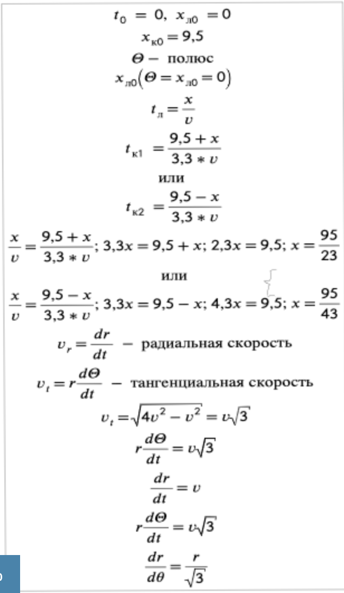
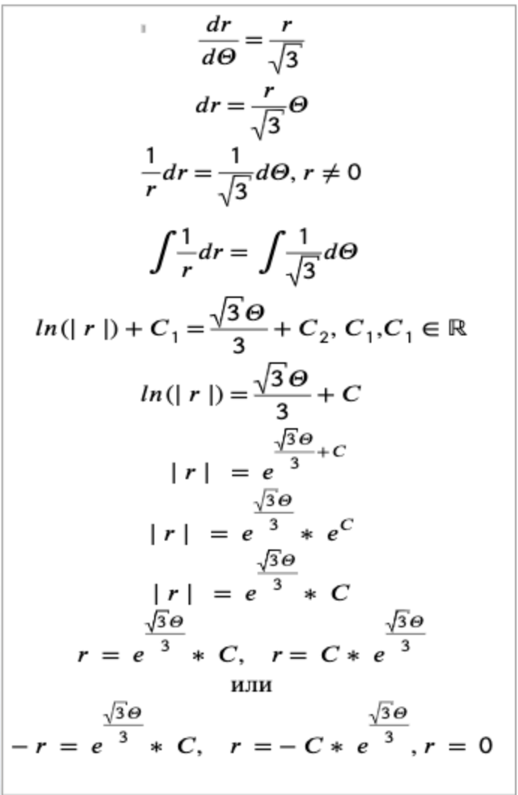
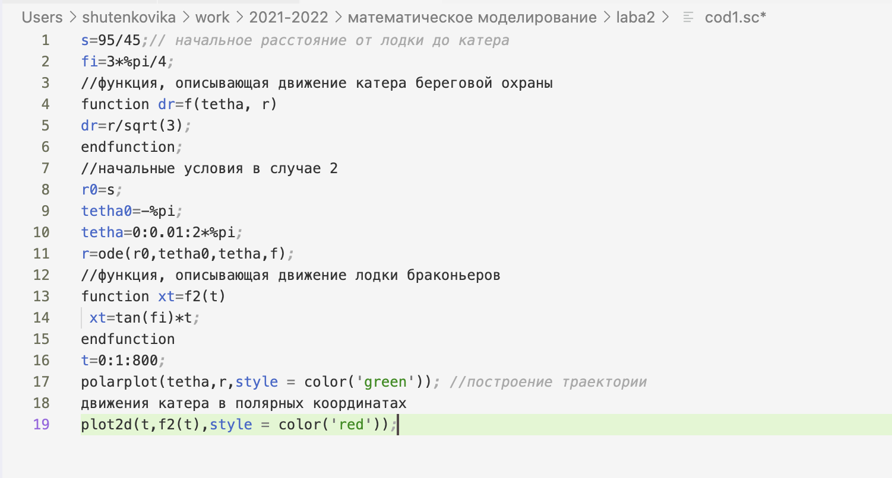
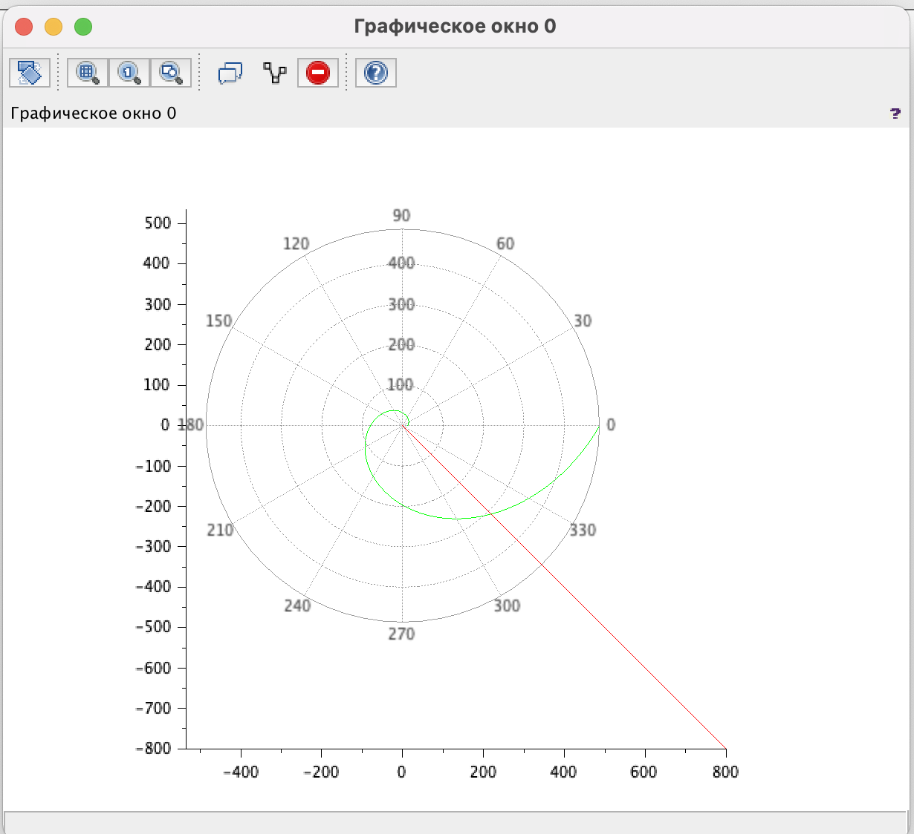
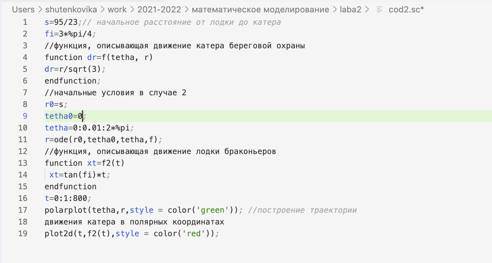
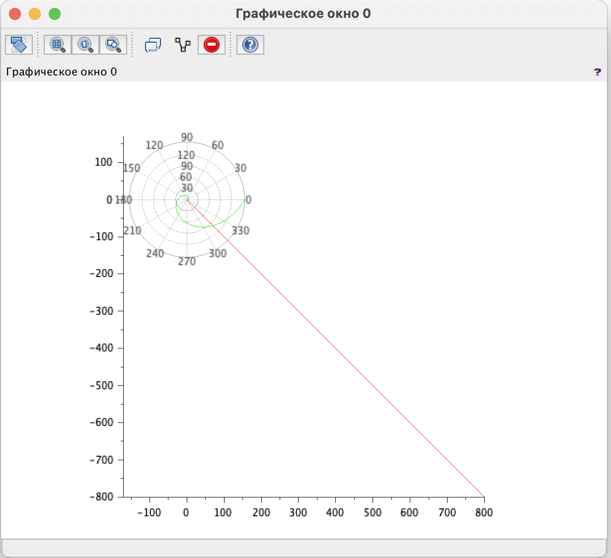
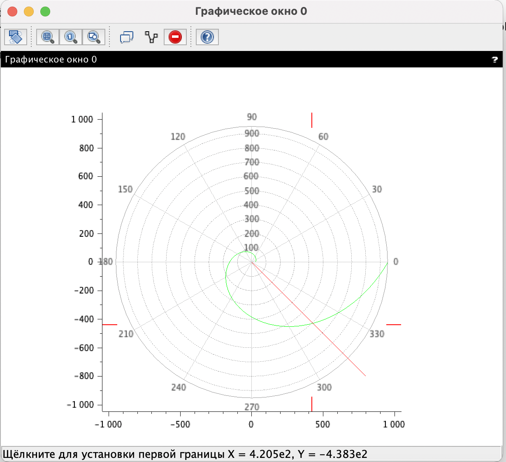

---
## Front matter
lang: ru-RU
title: Лабораторная работа №2
subtitle: Задача о погоне 
author: Victoria M. Shutenko
institute: RUDN University, Moscow, Russian Federation
date: 18 February, 2022, Moscow, Russian Federation

## Formatting
toc: false
slide_level: 2
theme: metropolis
header-includes: 
 - \metroset{progressbar=frametitle,sectionpage=progressbar,numbering=fraction}
 - '\makeatletter'
 - '\beamer@ignorenonframefalse'
 - '\makeatother'
aspectratio: 43
section-titles: true
---
# Цель выполнения лабораторной работы

Приобрести практические навыки при работе с задачей о погоне и scilab.

# Задание лабораторной работы

На море в тумане катер береговой охраны преследует лодку браконьеров.
Через определенный промежуток времени туман рассеивается, и лодка
обнаруживается на расстоянии 9,5 км от катера. Затем лодка снова скрывается в
тумане и уходит прямолинейно в неизвестном направлении. Известно, что скорость
катера в 3,3 раза больше скорости браконьерской лодки.

# Задание лабораторной работы

1. Запишите уравнение, описывающее движение катера, с начальными условиями для двух случаев (в зависимости от расположения катера относительно лодки в начальный момент времени).
2. Постройте траекторию движения катера и лодки для двух случаев.
3. Найдите точку пересечения траектории катера и лодки.

# Результаты выполнения лабораторной работы

{ #fig:001 width=10% }

{ #fig:001 width=10% }

# Результаты выполнения лабораторной работы

{ #fig:001 width=25% }

{ #fig:001 width=25% }

# Результаты выполнения лабораторной работы

{ #fig:001 width=25% }

{ #fig:001 width=25% }

# Результаты выполнения лабораторной работы

{ #fig:001 width=70% }

# Итоги выполнения лабораторной работы

- Записано уравнение  описывающее движение катера, с начальными условиями для двух случаев.
- Построена траекторию движения катера и лодки для двух случаев.
- Найдена точка пересечения траектории катера и лодки. 

