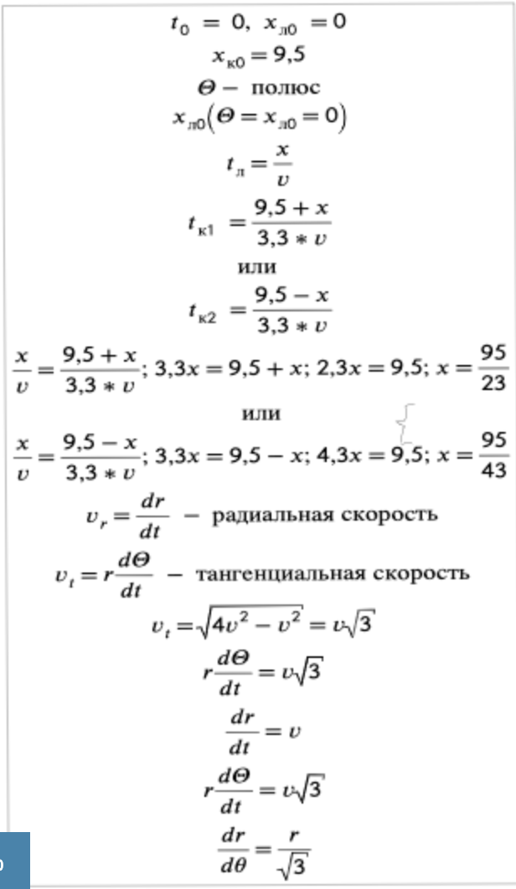
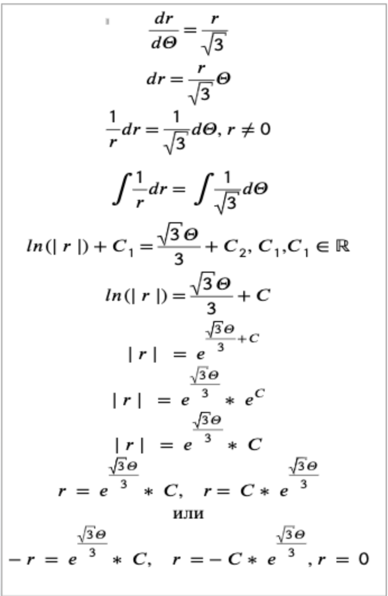
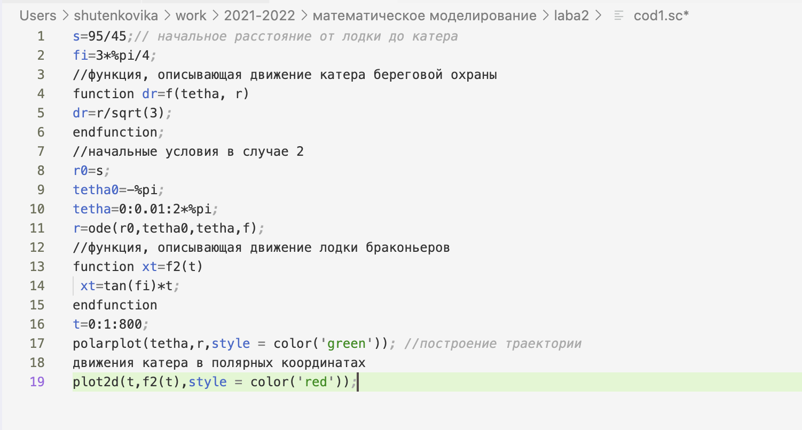
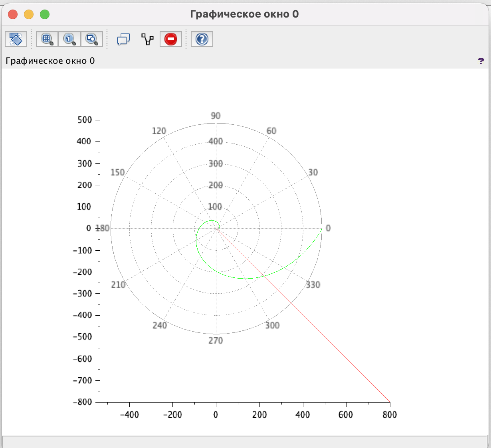
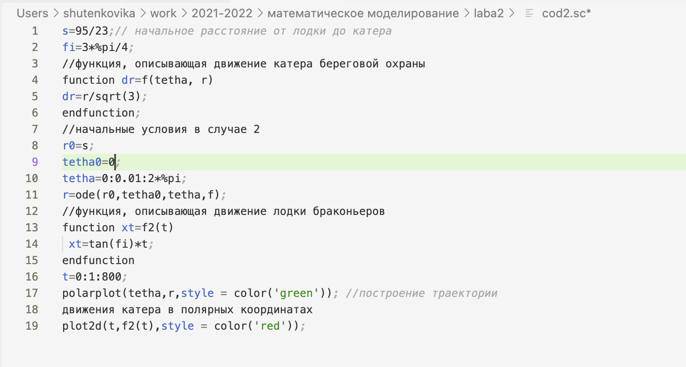
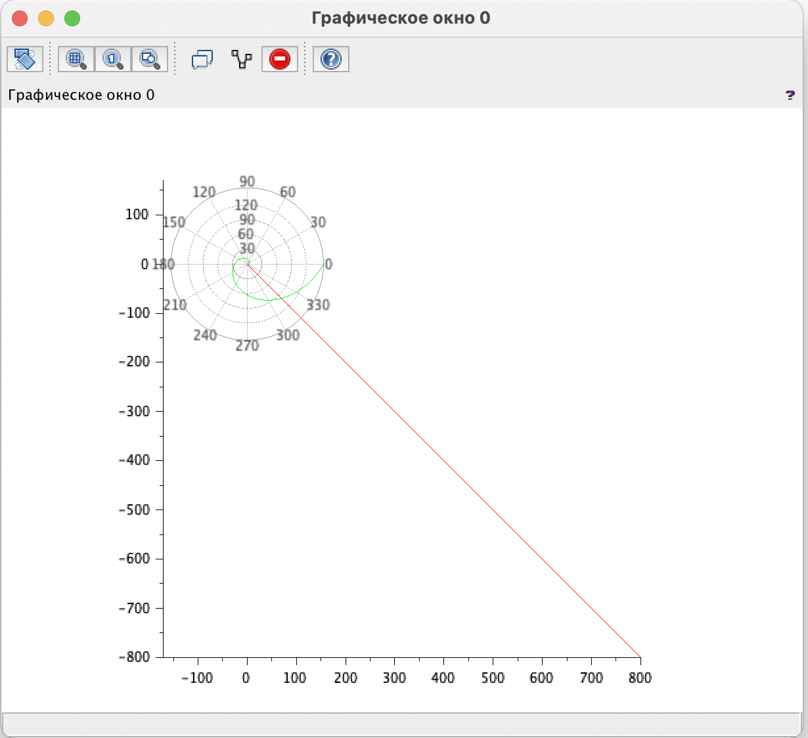
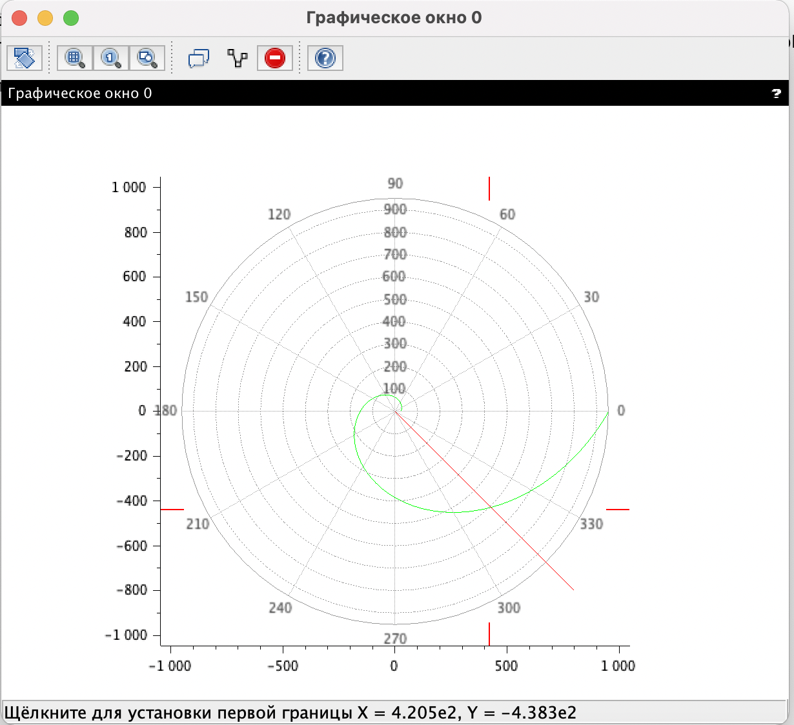

---
# Front matter
title: "Отчёт по лабораторной работе №2"
subtitle: "Задача о погоне"
author: "Виктория Михайловна Шутенко"

# Generic otions
lang: ru-RU
toc-title: "Содержание"

# Bibliography
bibliography: bib/cite.bib
csl: pandoc/csl/gost-r-7-0-5-2008-numeric.csl

# Pdf output format
toc: true # Table of contents
toc_depth: 2
lof: true # List of figures
lot: true # List of tables
fontsize: 12pt
linestretch: 1.5
papersize: a4
documentclass: scrreprt
## I18n
polyglossia-lang:
  name: russian
  options:
	- spelling=modern
	- babelshorthands=true
polyglossia-otherlangs:
  name: english
  name: el
### Fonts
mainfont: PT Serif
romanfont: PT Serif
sansfont: PT Sans
monofont: PT Mono
mainfontoptions: Ligatures=TeX
romanfontoptions: Ligatures=TeX
sansfontoptions: Ligatures=TeX,Scale=MatchLowercase
monofontoptions: Scale=MatchLowercase,Scale=0.9
## Biblatex
biblatex: true
biblio-style: "gost-numeric"
biblatexoptions:
  - parentracker=true
  - backend=biber
  - hyperref=auto
  - language=auto
  - autolang=other*
  - citestyle=gost-numeric
## Misc options
indent: true
header-includes:
  - \linepenalty=10 # the penalty added to the badness of each line within a paragraph (no associated penalty node) Increasing the value makes tex try to have fewer lines in the paragraph.
  - \interlinepenalty=0 # value of the penalty (node) added after each line of a paragraph.
  - \hyphenpenalty=50 # the penalty for line breaking at an automatically inserted hyphen
  - \exhyphenpenalty=50 # the penalty for line breaking at an explicit hyphen
  - \binoppenalty=700 # the penalty for breaking a line at a binary operator
  - \relpenalty=500 # the penalty for breaking a line at a relation
  - \clubpenalty=150 # extra penalty for breaking after first line of a paragraph
  - \widowpenalty=150 # extra penalty for breaking before last line of a paragraph
  - \displaywidowpenalty=50 # extra penalty for breaking before last line before a display math
  - \brokenpenalty=100 # extra penalty for page breaking after a hyphenated line
  - \predisplaypenalty=10000 # penalty for breaking before a display
  - \postdisplaypenalty=0 # penalty for breaking after a display
  - \floatingpenalty = 20000 # penalty for splitting an insertion (can only be split footnote in standard LaTeX)
  - \raggedbottom # or \flushbottom
  - \usepackage{float} # keep figures where there are in the text
  - \floatplacement{figure}{H} # keep figures where there are in the text

---

# Цель работы

Приобрести практические навыки при работе с задачей о погоне и scilab.

# Задание

## Вариант 16

На море в тумане катер береговой охраны преследует лодку браконьеров.
Через определенный промежуток времени туман рассеивается, и лодка
обнаруживается на расстоянии 9,5 км от катера. Затем лодка снова скрывается в
тумане и уходит прямолинейно в неизвестном направлении. Известно, что скорость
катера в 3,3 раза больше скорости браконьерской лодки.

1. Запишите уравнение, описывающее движение катера, с начальными условиями для двух случаев (в зависимости от расположения катераотносительно лодки в начальный момент времени).
2. Постройте траекторию движения катера и лодки для двух случаев.
3. Найдите точку пересечения траектории катера и лодки 

# Выполнение лабораторной работы

## 1. Запись уравнения, описывающего движение катера, с начальными условиями для двух случаев.

1. Принимаю за  t~0~ = 0, x~л0~ = 0 - место нахождения лодки браконьеров в момент обнаружения, х~к0~ = k - место нахождения катера береговой охраны относительно лодки браконьеров в момент обнаружения лодки.

2. Введу полярные координаты. Считаю, что полюс - это точка обнаружения лодки браконьеров x~л0~ ( $\theta\mathrm{ }$ = x~л0~ ), а полярная ось r проходит через точку нахождения катера береговой охраны.

3. Траектория катера должна быть такой, чтобы и катер, и лодка все время были на одном расстоянии от полюса $\theta\mathrm{ }$, только в этом случае траектория катера пересечется с траекторией лодки. Поэтому для начала катер береговой охраны должен двигаться некоторое время прямолинейно, пока не окажется на том же расстоянии от полюса, что и лодка браконьеров. После этого катер береговой охраны должен двигаться вокруг полюса удаляясь от него с той же скоростью, что и лодка браконьеров.

4. Чтобы найти расстояние x (расстояние после которого катер начнет двигаться вокруг полюса), составила простое уравнение. Пусть через время t катер и лодка окажутся на одном расстоянии x от полюса. За это время лодка пройдет x, а катер k - x (или k + x, в зависимости от начального положения катера относительно полюса). Время, за которое они пройдут это расстояние, вычисляю как x/v или k - x / 2v (во втором случае x + k / 2v). Так как время одно и то же, то эти величины одинаковы. Тогда неизвестное расстояние x могу найти из следующего уравнения: 

$\frac{x}{v} = \frac{k-x}{2v}$ в первом случае или

$\frac{x}{v} = \frac{x+k}{2v}$ во втором

Отсюда мы найдем два значения x~1~ = $\frac{k}{3}$ и x~2~ = k, задачу будем решать для
двух случаев.

5. После того, как катер береговой охраны окажется на одном расстоянии от полюса, что и лодка, он должен сменить прямолинейную траекторию и начать двигаться вокруг полюса удаляясь от него со скоростью лодки v.
Для этого скорость катера раскладываю на две составляющие:
v~r~ - радиальная скорость и v~$\tau\mathrm{ }$~ - тангенциальная скорость. Радиальная скорость - это скорость, с которой катер удаляется от полюса, v~r~ = $\frac{dr}{dt}$. Нам нужно, чтобы эта скорость была равна скорости лодки, поэтому полагаем $\frac{dr}{dt}$ = v. Тангенциальная скорость – это линейная скорость вращения катера относительно полюса. Она равна произведению угловой скорости
$\frac{d \theta\mathrm{ }}{dt}$ на радиус r,
v~$\tau\mathrm{ }$~ = r$\frac{d\theta\mathrm{ }}{dt}$
Из рисунка видно:
v~$\tau\mathrm{ }$~ = $\sqrt{4v^2 -v^2}$ = $\sqrt{3v}$

{ #fig:001 width=70% }

6. Решение исходной задачи сводится к решению системы из двух дифференциальных уравнений 


с начальными условиями $$
\left\{ 
\begin{array}{c}
\theta\mathrm{ }_0 = v \\ 
r_0 = x_1 \\ 
\end{array}
\right. 
$$

или $$
\left\{ 
\begin{array}{c}
\theta\mathrm{ }_0 = -\pi\mathrm{ }  \\ 
r_0 = x_2 \\ 
\end{array}
\right. 
$$

Исключая из полученной системы производную по t, могу перейти к следующему уравнению:

$$
\left\{ 
\begin{array}{c}
\frac{dr}{dt} = r \\ 
\frac{d\theta\mathrm{ }}{dt} = \sqrt{3} \\ 
\end{array}
\right. 
$$

 

Начальные условия остаются прежними. Решив эти уравнение, я получу траекторию движения катера в полярных координатах.

{ #fig:001 width=70% }

## 2. Построение траектории движения катера и лодки для двух случаев.

Для построения я использовала кот, приведённые в методичке, изменив исходные данные:

```
s=6; // начальное расстояние от лодки до катера
fi=3*%pi/4; //функция, описывающая движение катера береговой охраны
function dr=f(tetha, r)
dr=r/sqrt(3);
endfunction; //начальные условия в случае 2
r0=s;
tetha0=-%pi;
tetha=0:0.01:2*%pi;
r=ode(r0,tetha0,tetha,f); //функция, описывающая движение лодки браконьеров
function xt=f2(t)
 xt=tan(fi)*t;
endfunction
t=0:1:800;
polarplot(tetha,r,style = color('green')); //построение траектории движения катера в полярных координатах
plot2d(t,f2(t),style = color('red'));
```
{ #fig:001 width=70% }

{ #fig:001 width=70% }

{ #fig:001 width=70% }

{ #fig:001 width=70% }

## 3. Поиск точки пересечения траектории катера и лодки 

Точка пересечения искалась по графику. Координата (4,205е2; -4,383е2)

{ #fig:001 width=70% }

# Выводы

Я приобрела практические навыки при работе с задачей о погоне и scilab.

# Список литературы{.unnumbered}

::: {#refs}
:::
