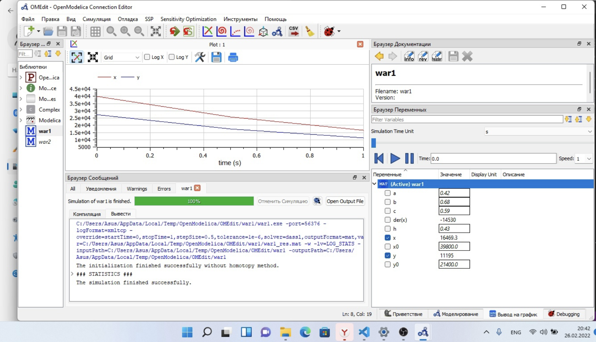
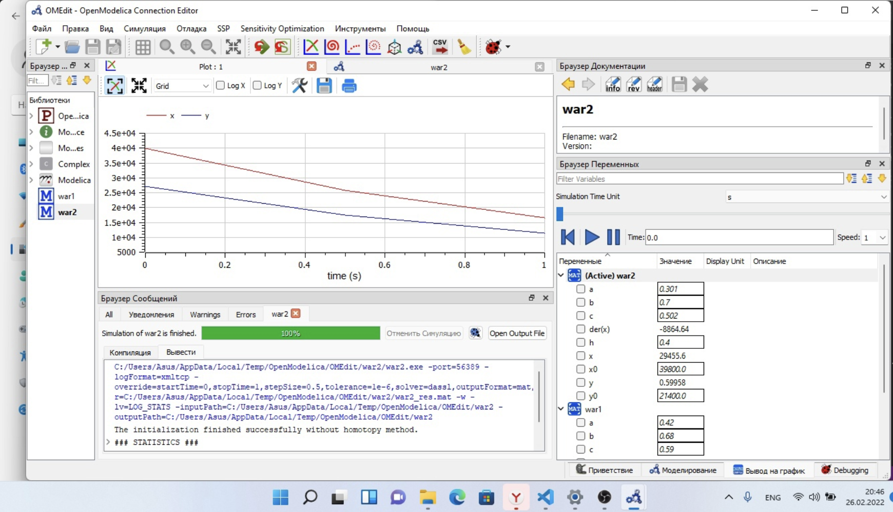

---
## Front matter
lang: ru-RU
title: Лабораторная работа №3
subtitle: Модель боевых действий
author: Victoria M. Shutenko
institute: RUDN University, Moscow, Russian Federation
date: 26 February, 2022, Moscow, Russian Federation

## Formatting
toc: false
slide_level: 2
theme: metropolis
header-includes: 
 - \metroset{progressbar=frametitle,sectionpage=progressbar,numbering=fraction}
 - '\makeatletter'
 - '\beamer@ignorenonframefalse'
 - '\makeatother'
aspectratio: 43
section-titles: true
---
# Цель выполнения лабораторной работы

Приобрести практические навыки при работе с моделью боевых действий.

# Задание лабораторной работы

Между страной $X$ и страной $Y$ идет война. Численность состава войск исчисляется от начала войны, и являются временными функциями $x(t)$ и $y(t)$. В начальный момент времени страна $X$ имеет армию численностью 39 800 человек, а в распоряжении страны $Y$ армия численностью в 21 400 человек. Для упрощения модели считаем, что коэффициенты $a, b, c, h$ постоянны. Также считаем
P(t) и Q(t) непрерывные функции.

# Задание лабораторной работы

Постройте графики изменения численности войск армии $Х$ и армии $У$ для следующих случаев:

1. Модель боевых действий между регулярными войсками

$\frac{dx}{dt}=-0,42x(t)-0,68y(t)+sin(5t+1)$

$\frac{dy}{dt}=-0,59x(t)-0,43y(t)+cos(5t+2)$

2. Модель ведение боевых действий с участием регулярных войск и партизанских отрядов 

$\frac{dx}{dt}=-0,301x(t)-0,7y(t)+sin(20t)+1$

$\frac{dy}{dt}=-0,502x(t)y(t)-0,4y(t)+cos(20t)+1$

# Результаты выполнения лабораторной работы

{ #fig:001 width=100% }

# Результаты выполнения лабораторной работы

{ #fig:001 width=100% }

# Итоги выполнения лабораторной работы

- изучена модель боевых действий;
- получены навыки работы с openmodelica;
- построено 2 графика