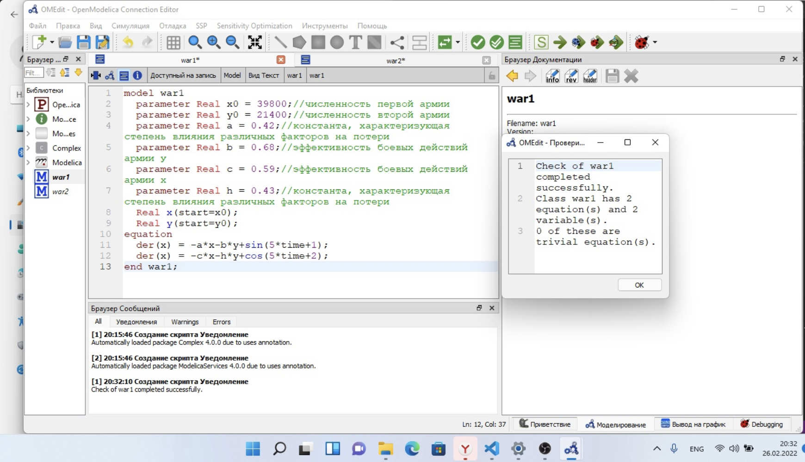
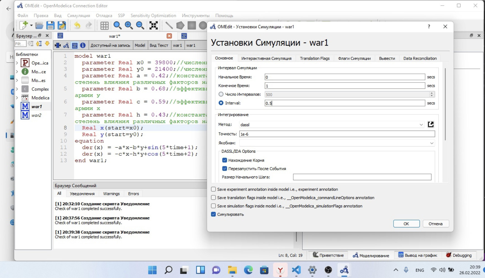
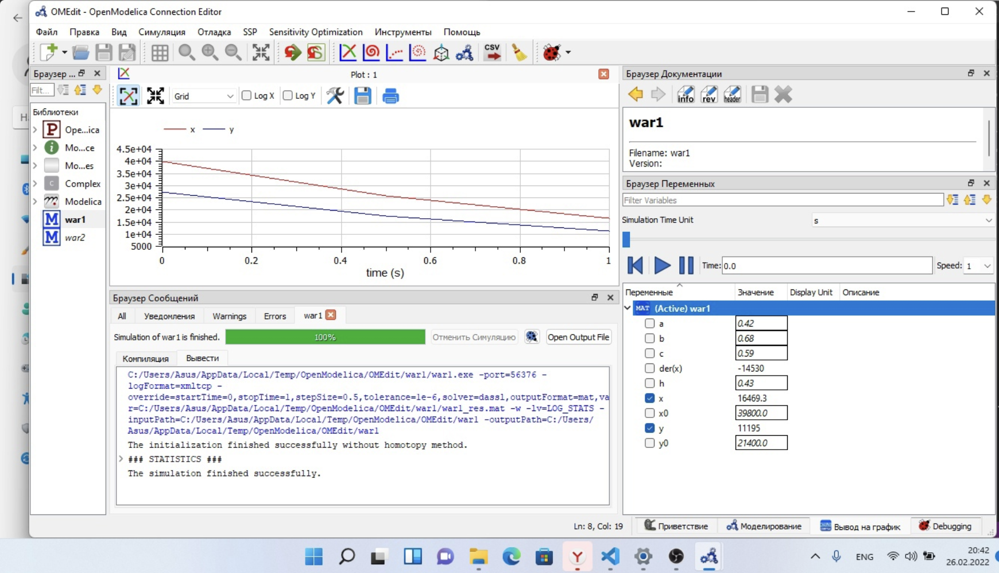
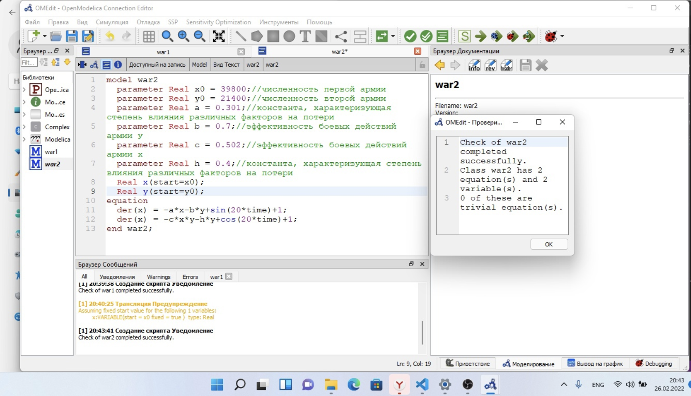
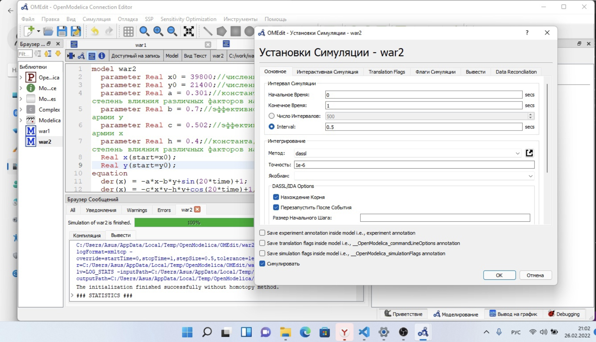
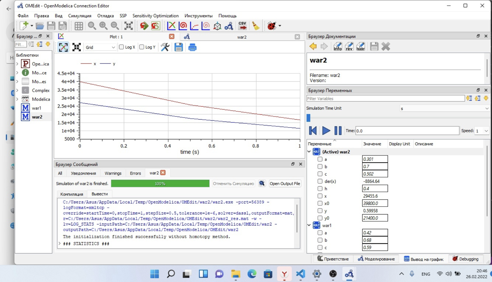

---
# Front matter
title: "Отчёт по лабораторной работе №3"
subtitle: "Модель боевых действий"
author: "Виктория Михайловна Шутенко"

# Generic otions
lang: ru-RU
toc-title: "Содержание"

# Bibliography
bibliography: bib/cite.bib
csl: pandoc/csl/gost-r-7-0-5-2008-numeric.csl

# Pdf output format
toc: true # Table of contents
toc_depth: 2
lof: true # List of figures
lot: true # List of tables
fontsize: 12pt
linestretch: 1.5
papersize: a4
documentclass: scrreprt
## I18n
polyglossia-lang:
  name: russian
  options:
	- spelling=modern
	- babelshorthands=true
polyglossia-otherlangs:
  name: english
  name: el
### Fonts
mainfont: PT Serif
romanfont: PT Serif
sansfont: PT Sans
monofont: PT Mono
mainfontoptions: Ligatures=TeX
romanfontoptions: Ligatures=TeX
sansfontoptions: Ligatures=TeX,Scale=MatchLowercase
monofontoptions: Scale=MatchLowercase,Scale=0.9
## Biblatex
biblatex: true
biblio-style: "gost-numeric"
biblatexoptions:
  - parentracker=true
  - backend=biber
  - hyperref=auto
  - language=auto
  - autolang=other*
  - citestyle=gost-numeric
## Misc options
indent: true
header-includes:
  - \linepenalty=10 # the penalty added to the badness of each line within a paragraph (no associated penalty node) Increasing the value makes tex try to have fewer lines in the paragraph.
  - \interlinepenalty=0 # value of the penalty (node) added after each line of a paragraph.
  - \hyphenpenalty=50 # the penalty for line breaking at an automatically inserted hyphen
  - \exhyphenpenalty=50 # the penalty for line breaking at an explicit hyphen
  - \binoppenalty=700 # the penalty for breaking a line at a binary operator
  - \relpenalty=500 # the penalty for breaking a line at a relation
  - \clubpenalty=150 # extra penalty for breaking after first line of a paragraph
  - \widowpenalty=150 # extra penalty for breaking before last line of a paragraph
  - \displaywidowpenalty=50 # extra penalty for breaking before last line before a display math
  - \brokenpenalty=100 # extra penalty for page breaking after a hyphenated line
  - \predisplaypenalty=10000 # penalty for breaking before a display
  - \postdisplaypenalty=0 # penalty for breaking after a display
  - \floatingpenalty = 20000 # penalty for splitting an insertion (can only be split footnote in standard LaTeX)
  - \raggedbottom # or \flushbottom
  - \usepackage{float} # keep figures where there are in the text
  - \floatplacement{figure}{H} # keep figures where there are in the text

---

# Цель работы

Приобрести практические навыки при работе с моделью боевых действий .

# Задание

## Вариант 16

Между страной $X$ и страной $Y$ идет война. Численность состава войск исчисляется от начала войны, и являются временными функциями $x(t)$ и $y(t)$. В начальный момент времени страна Х имеет армию численностью 39 800 человек, а в распоряжении страны У армия численностью в 21 400 человек. Для упрощения модели считаем, что коэффициенты $a, b, c, h$ постоянны. Также считаем
P(t) и Q(t) непрерывные функции.

Постройте графики изменения численности войск армии $X$ и армии $Y$ для следующих случаев:

1. Модель боевых действий между регулярными войсками

$\frac{dx}{dt}=-0,42x(t)-0,68y(t)+sin(5t+1)$

$\frac{dy}{dt}=-0,59x(t)-0,43y(t)+cos(5t+2)$

2. Модель ведение боевых действий с участием регулярных войск и партизанских отрядов 

$\frac{dx}{dt}=-0,301x(t)-0,7y(t)+sin(20t)+1$

$\frac{dy}{dt}=-0,502x(t)y(t)-0,4y(t)+cos(20t)+1$

# Выполнение лабораторной работы

## Модель боевых действий между регулярными войсками

В первом случае численность регулярных войск определяется тремя факторами:

- скорость уменьшения численности войск из-за причин, не связанных с боевыми действиями (болезни, травмы, дезертирство);
- скорость потерь, обусловленных боевыми действиями противоборствующих сторон (что связанно с качеством стратегии, уровнем вооружения, профессионализмом солдат и т.п.);
- скорость поступления подкрепления (задаётся некоторой функцией от времени). 

В моем случае модель боевых действий между регулярными войсками имеет следующий вид:

$\frac{dx}{dt}=-0,42x(t)-0,68y(t)+sin(5t+1)$

$\frac{dy}{dt}=-0,59x(t)-0,43y(t)+cos(5t+2)$

![Система 1]

где, 

$-0,42x(t)x(t)$ и $-0,43(t)y(t)$ - потери, не связанные с боевыми действиями;

$-0,68(t)y(t)$ и $-0,59(t)x(t)$ - потери на поле боя;

$-0,68(t)$ и $-0,42(t)$ - коэффициенты, указывающие на эффективность боевых действий со стороны $y$ и $x$ соответственно;

$0,42(t), 0,43(t)$ - величины, характеризующие степень
влияния различных факторов на потери;

$sin(5t+1)$, $cos(5t+2)$ - функции, учитывающие возможность подхода подкрепления к войскам $X$ и $Y$ в течение одного дня.


## Модель боевых действий между регулярными войсками

Во втором случае в борьбу добавляются партизанские отряды. Нерегулярные войска в отличии от постоянной армии менее уязвимы, так как действуют скрытно,
в этом случае сопернику приходится действовать неизбирательно, по площадям, занимаемым партизанами. Поэтому считается, что тем потерь партизан, проводящих свои операции в разных местах на некоторой известной территории, пропорционален не только численности армейских соединений, но и численности самих партизан. В результате модель принимает вид:

$\frac{dx}{dt}=-0,301x(t)-0,7y(t)+sin(20t)+1$

$\frac{dy}{dt}=-0,502x(t)y(t)-0,4y(t)+cos(20t)+1$

В этой системе все величины имею тот же смысл, что и в системе (1)

В простейшей модели борьбы двух противников коэффициенты
$-0,68(t)$ и $-0,59(t)$ являются постоянными.

## Построение графиков

# Программный код и построение 1 графика

Для первого случая в программе openmodelica я набрала следующий код:

```
model war1
	parameter Real x0 = 39800;//численность первой армии
	parameter Real y0 = 21400;//численность второй армии
	parameter Real a = 0.42;//константа, характеризующая степень влияния различных факторов на потери
	parameter Real b = 0.68;//эффективность боевых действий армии у
	parameter Real c = 0.59;//эффективность боевых действий армии х
	parameter Real h = 0.43;//константа, характеризующая степень влияния различных факторов на потери
	Real x(start=x0);
	Real y(start=y0);
equation
	der(x) = -a*x-b*y+sin(5*time+1);
	der(x) = -c*x-h*y+cos(5*time+2);
end war1;
```
Затем, я выполнила проверку кода.

{ #fig:001 width=70% }

После я делала установку стимуляции.

{ #fig:001 width=70% }

В итоге, я получила следующий график:

{ #fig:001 width=70% }

# Программный код и построение 2 графика

Для второго случая в программе openmodelica я набрала следующий код:

```
model war2
parameter Real x0 = 39800;//численность первой армии
parameter Real y0 = 21400;//численность второй армии
parameter Real a = 0.301;//константа, характеризующая степень влияния различных факторов на потери
parameter Real b = 0.7;//эффективность боевых действий армии у
parameter Real c = 0.502;//эффективность боевых действий армии х
parameter Real h = 0.4;//константа, характеризующая степень влияния различных факторов на потери
Real x(start=x0);
Real y(start=y0);
equation
der(x) = -a*x-b*y+sin(20*time)+1;
der(x) = -c*x*y-h*y+cos(20*time)+1;
end war2;
```
Затем, я выполнила проверку кода.

{ #fig:001 width=70% }

После я делала установку стимуляции.

{ #fig:001 width=70% }

В итоге, я получила следующий график:

{ #fig:001 width=70% }

