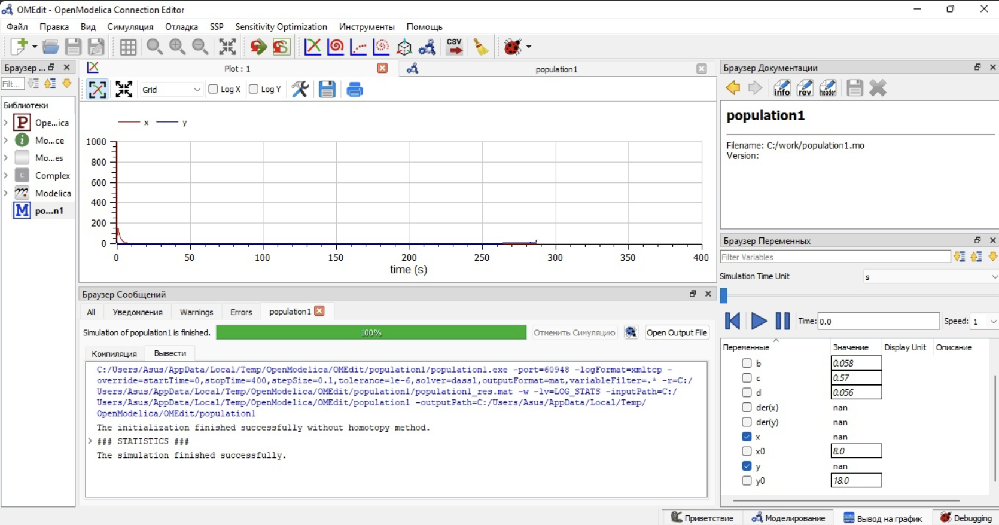
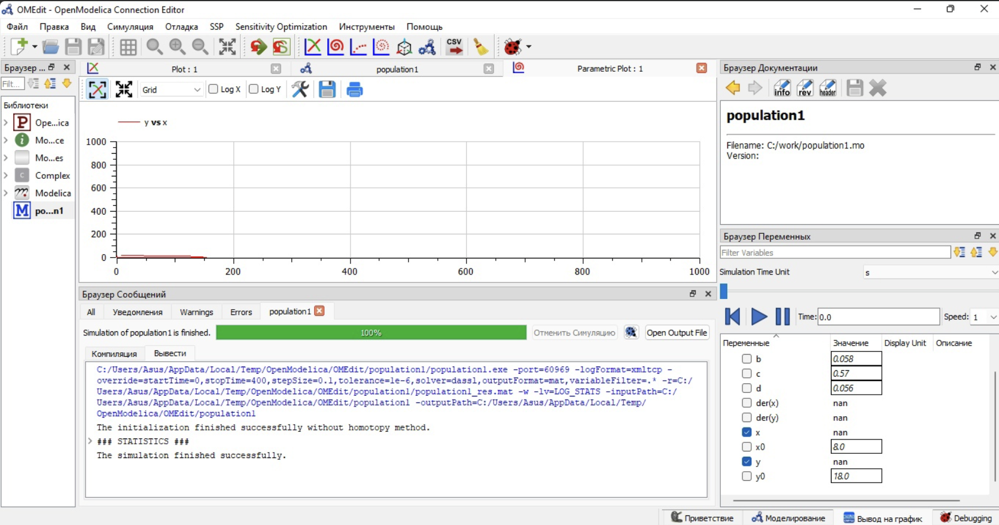
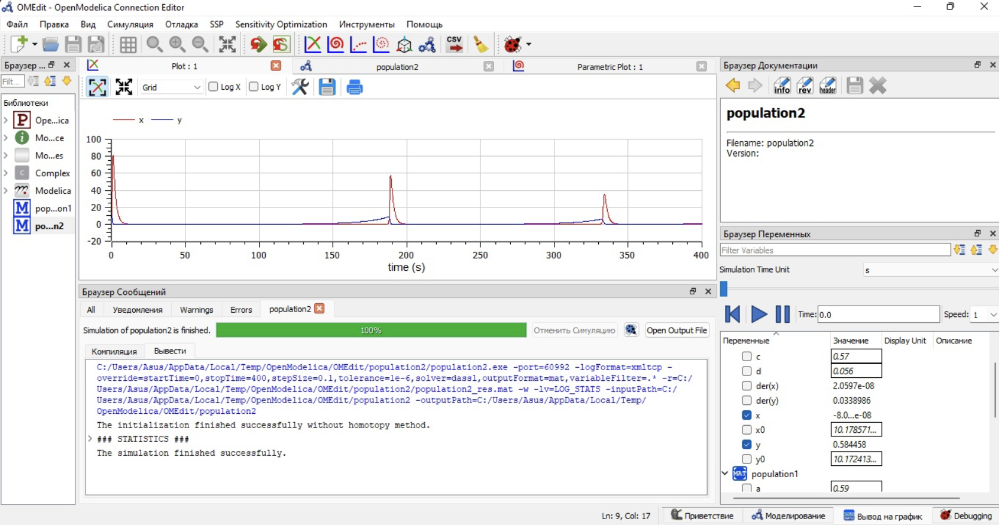

---
## Front matter
lang: ru-RU
title: Лабораторная работа №4
subtitle: Модель хищник-жертва.
author: Victoria M. Shutenko
institute: RUDN University, Moscow, Russian Federation
date: 5 March, 2022, Moscow, Russian Federation

## Formatting
toc: false
slide_level: 2
theme: metropolis
header-includes: 
 - \metroset{progressbar=frametitle,sectionpage=progressbar,numbering=fraction}
 - '\makeatletter'
 - '\beamer@ignorenonframefalse'
 - '\makeatother'
aspectratio: 43
section-titles: true
---
# Цель выполнения лабораторной работы

Приобрести практические навыки при работе с моделью хищник-жертва.

# Задание лабораторной работы

В лесу проживают х число волков, питающихся зайцами, число которых в этом же лесу у. Пока число зайцев достаточно велико, для прокормки всех волков,численность волков растет до тех пор, пока не наступит момент, что корма перестанет хватать на всех. Тогда волки начнут умирать, и их численность будетуменьшаться. В этом случае в какой-то момент времени численность зайцев снова
начнет увеличиваться, что повлечет за собой новый рост популяции волков. Такой цикл будет повторяться, пока обе популяции будут существовать. Помимо этого, на численность стаи влияют болезни и старение.

# Задание лабораторной работы

Данная модель описывается следующим уравнением:

$$
\begin{cases}
\frac{dx}{dt} = -ax(t) - bx(t)y(t) \\
\frac{dy}{dt} = cy(t) + dx(t)y(t)
\end{cases}
$$

где

$a,d$ - коэффициенты смертности

$b,c$ - коэффициенты прироста популяции

# Задание лабораторной работы

Для модели «хищник-жертва»:

$$
\begin{cases}
\frac{dx}{dt} = -0.59x(t) + 0.058x(t)y(t) \\
\frac{dy}{dt} = 0.57y(t) - 0.056x(t)y(t)
\end{cases}
$$

Постройте график зависимости численности хищников от численности жертв, а также графики изменения численности хищников и численности жертв при следующих начальных условиях: $x_0=8$ $y_0=18$. Найдите стационарное состояние системы.

# Результаты выполнения лабораторной работы

{ #fig:001 width=110% }

# Результаты выполнения лабораторной работы

{ #fig:001 width=110% }

# Результаты выполнения лабораторной работы

{ #fig:001 width=110% }

# Итоги выполнения лабораторной работы

- изучена модель хищник-жертва;
- получены навыки работы с openmodelica;
- построено 3 графикa