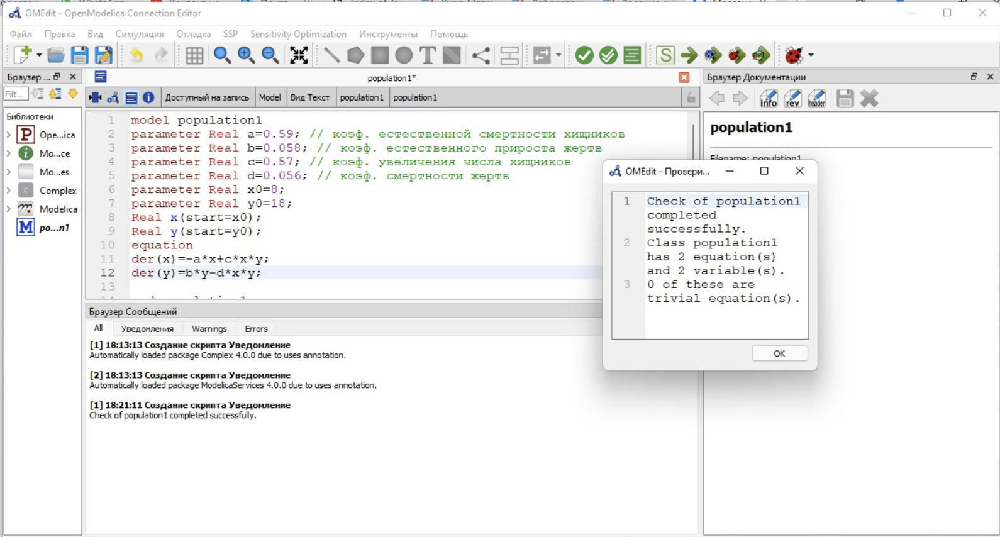
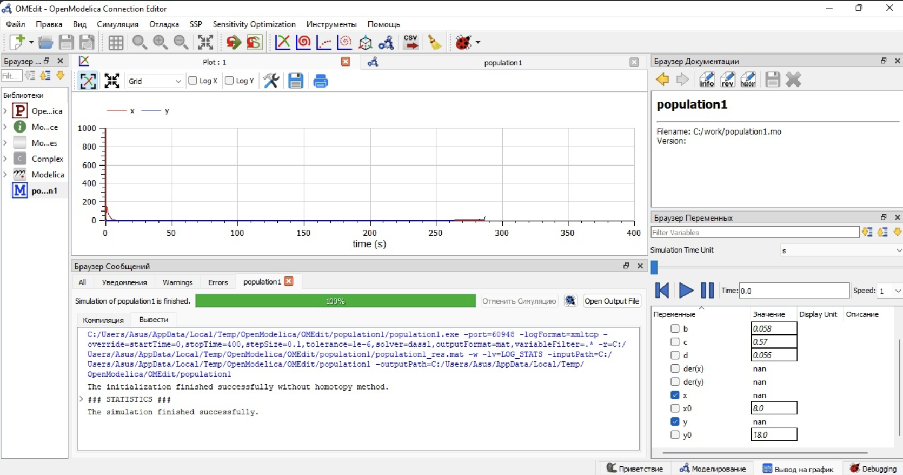
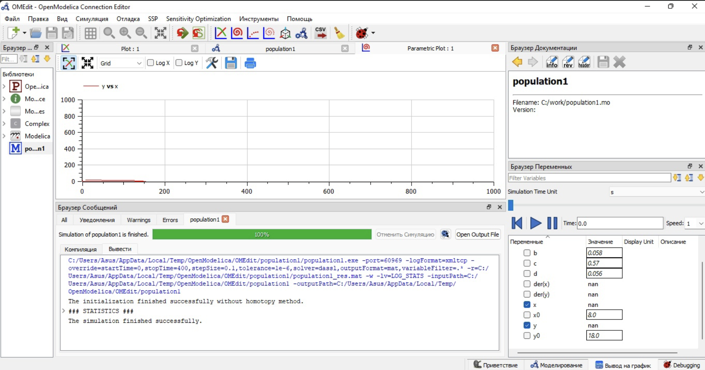
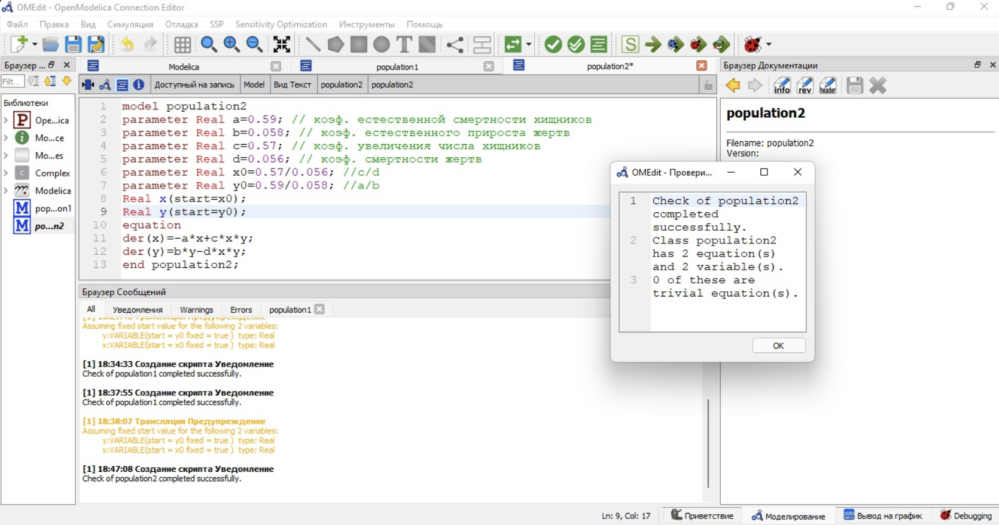
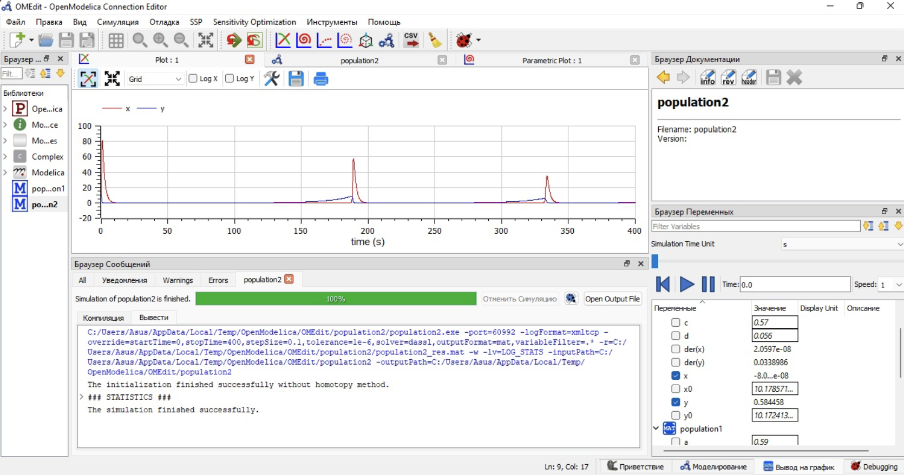

---
# Front matter
title: "Отчёт по лабораторной работе №5"
subtitle: "Модель хищник-жертва"
author: "Виктория Михайловна Шутенко"

# Generic otions
lang: ru-RU
toc-title: "Содержание"

# Bibliography
bibliography: bib/cite.bib
csl: pandoc/csl/gost-r-7-0-5-2008-numeric.csl

# Pdf output format
toc: true # Table of contents
toc_depth: 2
lof: true # List of figures
lot: true # List of tables
fontsize: 12pt
linestretch: 1.5
papersize: a4
documentclass: scrreprt
## I18n
polyglossia-lang:
  name: russian
  options:
	- spelling=modern
	- babelshorthands=true
polyglossia-otherlangs:
  name: english
  name: el
### Fonts
mainfont: PT Serif
romanfont: PT Serif
sansfont: PT Sans
monofont: PT Mono
mainfontoptions: Ligatures=TeX
romanfontoptions: Ligatures=TeX
sansfontoptions: Ligatures=TeX,Scale=MatchLowercase
monofontoptions: Scale=MatchLowercase,Scale=0.9
## Biblatex
biblatex: true
biblio-style: "gost-numeric"
biblatexoptions:
  - parentracker=true
  - backend=biber
  - hyperref=auto
  - language=auto
  - autolang=other*
  - citestyle=gost-numeric
## Misc options
indent: true
header-includes:
  - \linepenalty=10 # the penalty added to the badness of each line within a paragraph (no associated penalty node) Increasing the value makes tex try to have fewer lines in the paragraph.
  - \interlinepenalty=0 # value of the penalty (node) added after each line of a paragraph.
  - \hyphenpenalty=50 # the penalty for line breaking at an automatically inserted hyphen
  - \exhyphenpenalty=50 # the penalty for line breaking at an explicit hyphen
  - \binoppenalty=700 # the penalty for breaking a line at a binary operator
  - \relpenalty=500 # the penalty for breaking a line at a relation
  - \clubpenalty=150 # extra penalty for breaking after first line of a paragraph
  - \widowpenalty=150 # extra penalty for breaking before last line of a paragraph
  - \displaywidowpenalty=50 # extra penalty for breaking before last line before a display math
  - \brokenpenalty=100 # extra penalty for page breaking after a hyphenated line
  - \predisplaypenalty=10000 # penalty for breaking before a display
  - \postdisplaypenalty=0 # penalty for breaking after a display
  - \floatingpenalty = 20000 # penalty for splitting an insertion (can only be split footnote in standard LaTeX)
  - \raggedbottom # or \flushbottom
  - \usepackage{float} # keep figures where there are in the text
  - \floatplacement{figure}{H} # keep figures where there are in the text

---

# Цель работы

Приобрести практические навыки при работе с моделью хищник-жертва.

# Задание

## Задача

В лесу проживают х число волков, питающихся зайцами, число которых в
этом же лесу у. Пока число зайцев достаточно велико, для прокормки всех волков,численность волков растет до тех пор, пока не наступит момент, что корма
перестанет хватать на всех. Тогда волки начнут умирать, и их численность будет
уменьшаться. В этом случае в какой-то момент времени численность зайцев снова
начнет увеличиваться, что повлечет за собой новый рост популяции волков. Такой
цикл будет повторяться, пока обе популяции будут существовать. Помимо этого, на численность стаи влияют болезни и старение.
Данная модель описывается следующим уравнением:

$$
\begin{cases}
\frac{dx}{dt} = -ax(t) - bx(t)y(t) \\
\frac{dy}{dt} = cy(t) + dx(t)y(t)
\end{cases}
$$

где

$a,d$ - коэффициенты смертности

$b,c$ - коэффициенты прироста популяции

## Вариант 16

Для модели «хищник-жертва»:

$$
\begin{cases}
\frac{dx}{dt} = -0.59x(t) + 0.058x(t)y(t) \\
\frac{dy}{dt} = 0.57y(t) - 0.056x(t)y(t)
\end{cases}
$$

Постройте график зависимости численности хищников от численности жертв, а также графики изменения численности хищников и численности жертв при следующих начальных условиях: $x_0=8$ $y_0=18$. Найдите стационарное состояние системы.

# Теоретические сведения 

Простейшая модель взаимодействия двух видов типа «хищник — жертва» - модель Лотки-Вольтерры. Данная двувидовая модель основывается на следующих предположениях:
1. Численность популяции жертв x и хищников y зависят только от времени (модель не учитывает пространственное распределение популяции назанимаемой территории)
2. В отсутствии взаимодействия численность видов изменяется по модели Мальтуса, при этом число жертв увеличивается, а число хищников падает
3. Естественная смертность жертвы и естественная рождаемость хищника считаются несущественными
4. Эффект насыщения численности обеих популяций не учитывается
5. Скорость роста численности жертв уменьшается пропорционально численности хищников

$$
\begin{cases}
\frac{dx}{dt} = -ax(t) + bx(t)y(t) \\
\frac{dy}{dt} = cx(t) - dx(t)y(t)
\end{cases}
$$

В этой модели $x$ – число жертв, $y$ - число хищников. Коэффициент $a$ описывает скорость естественного прироста числа жертв в отсутствие хищников, $c$ - естественное вымирание хищников, лишенных пищи в виде жертв. Вероятность взаимодействия жертвы и хищника считается пропорциональной как количеству жертв, так и числу самих хищников $(xy)$. Каждый акт взаимодействия уменьшает популяцию жертв, но способствует увеличению популяции хищников (члены $-bxy$ и $dxy$ в правой части уравнения).

Стационарное состояние системы - положение равновесия, не зависящее от времени решение, которое будет в точке:
$x_0 = \frac{c}{d}$
$y_0 = \frac{a}{b}$


# Выполнение работы

## Построение графика зависимости численности хищников от численности жертв, а также графика изменения численности хищников и численности жертв 

Я написала следующий код:
```
model population1
parameter Real a=0.59; // коэф. естественной смертности хищников
parameter Real b=0.058; // коэф. естественного прироста жертв
parameter Real c=0.57; // коэф. увеличения числа хищников
parameter Real d=0.056; // коэф. смертности жертв
parameter Real x0=8;
parameter Real y0=18;
Real x(start=x0);
Real y(start=y0);
equation
der(x)=-a*x+c*x*y;
der(y)=b*y-d*x*y;
end population1;
```
Я выполнила проверку кода.

{ #fig:001 width=100% }

После я делала установку симуляции.

{ #fig:001 width=100% }

В итоге, я получила следующие графики:

{ #fig:001 width=110% }

{ #fig:001 width=110% }

## Поиск стационарного состояние системы.

Стационарное состояние системы будет в точке:
$x_0 = \frac{0.57}{0.056}$
$y_0 = \frac{0.59}{0.056}$

Я написала следующий код:
```
model population2
parameter Real a=0.59; // коэф. естественной смертности хищников
parameter Real b=0.058; // коэф. естественного прироста жертв
parameter Real c=0.57; // коэф. увеличения числа хищников
parameter Real d=0.056; // коэф. смертности жертв
parameter Real x0=0.058/0.056;//b/d
parameter Real y0=0.59/0.57;//a/c
Real x(start=x0);
Real y(start=y0);
equation
der(x)=-a*x+c*x*y;
der(y)=b*y-d*x*y;
end population2;
```

Я выполнила проверку кода.

{ #fig:001 width=100% }

После я делала установку симуляции.

{ #fig:001 width=100% }

В итоге, я получила следующий график:

{ #fig:001 width=110% }

# Выводы

Я приобрела практические навыки при работе с моделью хищник-жертва.

# Библиография{.unnumbered}

1. https://ru.wikipedia.org/wiki/Модель_Лотки_—_Вольтерры
2. Браун Джанет. Чарльз Дарвин. Происхождение видов / Сер. «10 книг, изменивших мир». М.: АСТ: аст., 2009 220 с.
3. Malthus T.R. An assay on the principle of population, as it affects the future improvement of society. 1798 http://www.faculty.rsu.edu/ felwell/Theorists/Malthus/essay2.htm
4. Lotka A. Elements of Physical Biology. Baltimore, 1925 Reprinted by Dover in 1956 as Elements of Mathematical Biology.
5. Вольтерра В.Математическая теория борьбы за существование / Пер. с франц. М.: Наука, Главная редакция физико-математической литературы, 1976 288 с.
6. Братусь А.С., Новожилов А.С., Платонов А.П. Динамические системы и модели биологии. М.: ФИЗМАТЛИТ, 2010 400 с.

