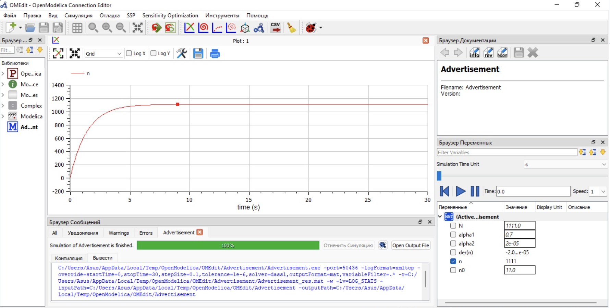
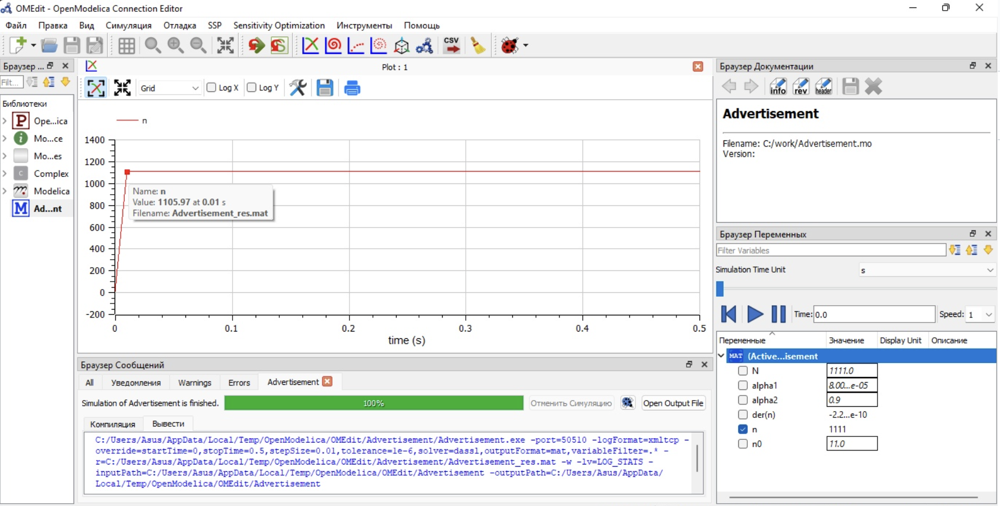
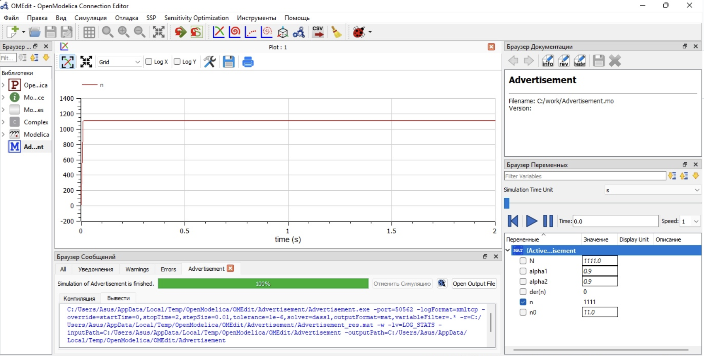

---
## Front matter
lang: ru-RU
title: Лабораторная работа №7
subtitle: Модель "Эффективность рекламы".
author: Victoria M. Shutenko
institute: RUDN University, Moscow, Russian Federation
date: 26 March, 2022, Moscow, Russian Federation

## Formatting
toc: false
slide_level: 2
theme: metropolis
header-includes: 
 - \metroset{progressbar=frametitle,sectionpage=progressbar,numbering=fraction}
 - '\makeatletter'
 - '\beamer@ignorenonframefalse'
 - '\makeatother'
aspectratio: 43
section-titles: true
---
# Цель выполнения лабораторной работы

Приобрести практические навыки при работе с моделью "Эффективность рекламы".

# Задание лабораторной работы

Постройте график распространения рекламы, математическая модель которой описывается
следующим уравнением:

$$\frac{dn}{dt}=(0.7+0.00002n(t))(N-n(t))$$
$$\frac{dn}{dt}=(0.00008+0.9n(t))(N-n(t))$$
$$\frac{dn}{dt}=(0.9cos(t)+0.9cos(t)n(t))(N-n(t))$$

При этом объем аудитории $N=1111$, в начальный момент о товаре знает $11$ человек. Для случая 2 определите в какой момент времени скорость распространения рекламы будет иметь максимальное значение.

# Результаты выполнения лабораторной работы

{ #fig:001 width=110% }

# Результаты выполнения лабораторной работы

{ #fig:001 width=110% }

# Результаты выполнения лабораторной работы

{ #fig:001 width=110% }

# Итоги выполнения лабораторной работы

- изучена модель "Эффективность рекламы";
- получены навыки работы с openmodelica;
- построено 3 графикa