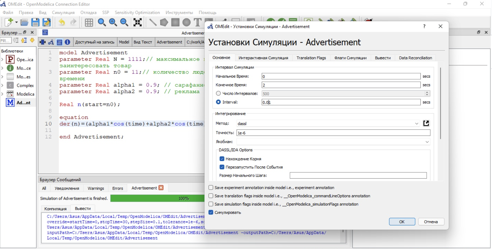

---
# Front matter
title: "Отчёт по лабораторной работе №7"
subtitle: "Модель ''Эффективность рекламы''"
author: "Виктория Михайловна Шутенко"

# Generic otions
lang: ru-RU
toc-title: "Содержание"

# Bibliography
bibliography: bib/cite.bib
csl: pandoc/csl/gost-r-7-0-5-2008-numeric.csl

# Pdf output format
toc: true # Table of contents
toc_depth: 2
lof: true # List of figures
lot: true # List of tables
fontsize: 12pt
linestretch: 1.5
papersize: a4
documentclass: scrreprt
## I18n
polyglossia-lang:
  name: russian
  options:
	- spelling=modern
	- babelshorthands=true
polyglossia-otherlangs:
  name: english
  name: el
### Fonts
mainfont: PT Serif
romanfont: PT Serif
sansfont: PT Sans
monofont: PT Mono
mainfontoptions: Ligatures=TeX
romanfontoptions: Ligatures=TeX
sansfontoptions: Ligatures=TeX,Scale=MatchLowercase
monofontoptions: Scale=MatchLowercase,Scale=0.9
## Biblatex
biblatex: true
biblio-style: "gost-numeric"
biblatexoptions:
  - parentracker=true
  - backend=biber
  - hyperref=auto
  - language=auto
  - autolang=other*
  - citestyle=gost-numeric
## Misc options
indent: true
header-includes:
  - \linepenalty=10 # the penalty added to the badness of each line within a paragraph (no associated penalty node) Increasing the value makes tex try to have fewer lines in the paragraph.
  - \interlinepenalty=0 # value of the penalty (node) added after each line of a paragraph.
  - \hyphenpenalty=50 # the penalty for line breaking at an automatically inserted hyphen
  - \exhyphenpenalty=50 # the penalty for line breaking at an explicit hyphen
  - \binoppenalty=700 # the penalty for breaking a line at a binary operator
  - \relpenalty=500 # the penalty for breaking a line at a relation
  - \clubpenalty=150 # extra penalty for breaking after first line of a paragraph
  - \widowpenalty=150 # extra penalty for breaking before last line of a paragraph
  - \displaywidowpenalty=50 # extra penalty for breaking before last line before a display math
  - \brokenpenalty=100 # extra penalty for page breaking after a hyphenated line
  - \predisplaypenalty=10000 # penalty for breaking before a display
  - \postdisplaypenalty=0 # penalty for breaking after a display
  - \floatingpenalty = 20000 # penalty for splitting an insertion (can only be split footnote in standard LaTeX)
  - \raggedbottom # or \flushbottom
  - \usepackage{float} # keep figures where there are in the text
  - \floatplacement{figure}{H} # keep figures where there are in the text

---

# Цель работы

Приобрести практические навыки при работе с моделью "Эффективность рекламы".

# Теоретические сведения 

Предположим, что торговыми учреждениями реализуется некоторая продукция, о которой в момент времени $t$ из числа потенциальных покупателей $N$ знает лишь $n$ покупателей. Для ускорения сбыта продукции запускается реклама gо радио, телевидению и других средств массовой информации. После запуска рекламной кампании информация о продукции начнет распространяться среди
потенциальных покупателей путем общения друг с другом. Таким образом, после запуска рекламных объявлений скорость изменения числа знающих о продукции людей пропорциональна как числу знающих о товаре покупателей, так и числу покупателей о нем не знающи.

Математическая модель распространения рекламы описывается уравнением:

$$\frac{dn}{dt}=(\alpha_1(t)+\alpha_2(t)n(t))(N-n(t))$$

Возможны 2 случая

- $\alpha_1(t)\gg\alpha_2(t)$

- $\alpha_1(t)\ll\alpha_2(t)$

# Задание

## Вариант 16

Постройте график распространения рекламы, математическая модель которой описывается
следующим уравнением:

$$\frac{dn}{dt}=(0.7+0.00002n(t))(N-n(t))$$
$$\frac{dn}{dt}=(0.00008+0.9n(t))(N-n(t))$$
$$\frac{dn}{dt}=(0.9cos(t)+0.9cos(t)n(t))(N-n(t))$$

При этом объем аудитории
$N=1111$, в начальный момент о товаре знает $11$ человек. Для случая 2 определите в какой момент времени скорость распространения рекламы будет иметь максимальное значение.

# Ход работы

Для 1 случая я написала следующий код:

```
model Advertisement
parameter Real N = 1111;// максимальное количество людей, которых может заинтересовать товар
parameter Real n0 = 11;// количество людей, знающих о товаре в начальный момент времени
parameter Real alpha1 = 0.7; // сарафанное радио
parameter Real alpha2 = 0.00002; // реклама
Real n(start=n0);
equation
der(n)=(alpha1+alpha2*n)*(N-n); // случай 1
end Advertisement
```

Я выполнила проверку кода.

{ #fig:001 width=100% }

После я делала установку симуляции.

{ #fig:001 width=100% }

В итоге, я получила следующие график:

{ #fig:001 width=110% }

Для 2 случая я написала следующий код:

```
model Advertisement
parameter Real N = 1111;// максимальное количество людей, которых может заинтересовать товар
parameter Real n0 = 11;// количество людей, знающих о товаре в начальный момент времени
parameter Real alpha1 = 0.00008; // сарафанное радио
parameter Real alpha2 = 0.9; // реклама
Real n(start=n0);
equation
der(n)=(alpha2+alpha1*n)*(N-n); // случай 2
end Advertisement
```

Я выполнила проверку кода.

{ #fig:001 width=100% }

После я делала установку симуляции.

{ #fig:001 width=100% }

В итоге, я получила следующие график:

{ #fig:001 width=110% }

Также во втором случае надо было определить в какой момент времени скорость распространения рекламы будет иметь максимальное значение. Я определила по графику, что это 0,01.

Для 3 случая я написала следующий код:

```
model Advertisement3
parameter Real N = 1111;// максимальное количество людей, которых может заинтересовать товар
parameter Real n0 = 11;// количество людей, знающих о товаре в начальный момент времени
parameter Real alpha1 = 0.9; // сарафанное радио
parameter Real alpha2 = 0.9; // реклама
Real n(start=n0);
equation
der(n)=(alpha1*cos(time)+alpha1*cos(time)*n)*(N-n); // случай 3
end Advertisement3
```

Я выполнила проверку кода.

{ #fig:001 width=100% }

После я делала установку симуляции.

{ #fig:001 width=100% }

В итоге, я получила следующие график:

{ #fig:001 width=110% }

# Выводы

Я приобрела практические навыки при работе с моделью "Эффективность рекламы".

# Библиография{.unnumbered}
-	Родионов, Ю.В. Основы математического моделирования: учебное электронное изда-ние / Ю.В. Родионов, А.Д. Нахман ; Тамбовский государственный технический универ-ситет. – Тамбов : Тамбовский государственный технический университет (ТГТУ), 2018. – 111 с. : табл., граф. – Режим доступа: по подписке. – URL: https://biblioclub.ru/index.php?page=book&id=570456. – Библиогр. в кн. – ISBN 978-5-8265-1886-1. – Текст : электронный.
-	Самарский Александр Андреевич. Математическое моделирование. Идеи. Методы. Примеры [Текст] / А.А. Самарский, А.П. Михайлов. - 2-е изд., испр. - М. : Физматлит, 2002. - 320 с. : ил. - ISBN 5-92221-0120-Х : 115.94. (ЕТ 20)
-	Введение в математическое моделирование : учебное пособие / В.Н. Ашихмин, М.Б. Гитман, И.Э. Келлер [и др.]; Под ред. П.В. Трусова. - Электронные текстовые данные. - М. : Логос, 2015. - 440 с. : ил. - (Новая Университетская Библиотека). - ISBN 978-5-98704-637-1. URL: http://lib.rudn.ru/ProtectedView/Book/ViewBook/5847
-	Документация по системе Modelica – Режим доступа: https://www.modelica.org/