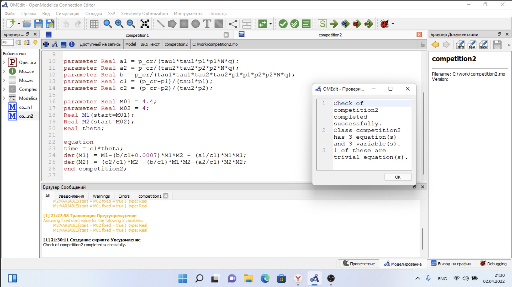

---
# Front matter
title: "Отчёт по лабораторной работе №8"
subtitle: "Модель конкуренции двух фирм"
author: "Виктория Михайловна Шутенко"

# Generic otions
lang: ru-RU
toc-title: "Содержание"

# Bibliography
bibliography: bib/cite.bib
csl: pandoc/csl/gost-r-7-0-5-2008-numeric.csl

# Pdf output format
toc: true # Table of contents
toc_depth: 2
lof: true # List of figures
lot: true # List of tables
fontsize: 12pt
linestretch: 1.5
papersize: a4
documentclass: scrreprt
## I18n
polyglossia-lang:
  name: russian
  options:
	- spelling=modern
	- babelshorthands=true
polyglossia-otherlangs:
  name: english
  name: el
### Fonts
mainfont: PT Serif
romanfont: PT Serif
sansfont: PT Sans
monofont: PT Mono
mainfontoptions: Ligatures=TeX
romanfontoptions: Ligatures=TeX
sansfontoptions: Ligatures=TeX,Scale=MatchLowercase
monofontoptions: Scale=MatchLowercase,Scale=0.9
## Biblatex
biblatex: true
biblio-style: "gost-numeric"
biblatexoptions:
  - parentracker=true
  - backend=biber
  - hyperref=auto
  - language=auto
  - autolang=other*
  - citestyle=gost-numeric
## Misc options
indent: true
header-includes:
  - \linepenalty=10 # the penalty added to the badness of each line within a paragraph (no associated penalty node) Increasing the value makes tex try to have fewer lines in the paragraph.
  - \interlinepenalty=0 # value of the penalty (node) added after each line of a paragraph.
  - \hyphenpenalty=50 # the penalty for line breaking at an automatically inserted hyphen
  - \exhyphenpenalty=50 # the penalty for line breaking at an explicit hyphen
  - \binoppenalty=700 # the penalty for breaking a line at a binary operator
  - \relpenalty=500 # the penalty for breaking a line at a relation
  - \clubpenalty=150 # extra penalty for breaking after first line of a paragraph
  - \widowpenalty=150 # extra penalty for breaking before last line of a paragraph
  - \displaywidowpenalty=50 # extra penalty for breaking before last line before a display math
  - \brokenpenalty=100 # extra penalty for page breaking after a hyphenated line
  - \predisplaypenalty=10000 # penalty for breaking before a display
  - \postdisplaypenalty=0 # penalty for breaking after a display
  - \floatingpenalty = 20000 # penalty for splitting an insertion (can only be split footnote in standard LaTeX)
  - \raggedbottom # or \flushbottom
  - \usepackage{float} # keep figures where there are in the text
  - \floatplacement{figure}{H} # keep figures where there are in the text

---

# Цель работы

Приобрести практические навыки при работе с моделью конкуренции двух фирм.

# Теоретические сведения 

Для построения модели конкуренции хотя бы двух фирм необходимо
рассмотреть модель одной фирмы. Вначале рассмотрим модель фирмы,
производящей продукт долговременного пользования, когда цена его определяется
балансом спроса и предложения. Примем, что этот продукт занимает
определенную нишу рынка и конкуренты в ней отсутствуют.
Обозначим:

$N$ – число потребителей производимого продукта.

$S$ – доходы потребителей данного продукта. Считаем, что доходы всех
потребителей одинаковы. Это предположение справедливо, если речь идет об
одной рыночной нише, т.е. производимый продукт ориентирован на определенный
слой населения.

$M$ – оборотные средства предприятия

$\tau$ – длительность производственного цикла

$p$ – рыночная цена товара

$\tilde p$ – себестоимость продукта, то есть переменные издержки на производство
единицы продукции.

$\delta$ – доля оборотных средств, идущая на покрытие переменных издержек.
$κ$ – постоянные издержки, которые не зависят от количества выпускаемой
продукции.

$Q(S/p)$ – функция спроса, зависящая от отношения дохода S к цене p. Она
равна количеству продукта, потребляемого одним потребителем в единицу
времени.

Функцию спроса товаров долговременного использования часто
представляют в простейшей форме:

$$Q=q-k \frac{p}{S}=q(1 - \frac{p}{p_{cr}})$$ (1)

где $q$ – максимальная потребность одного человека в продукте в единицу времени.
Эта функция падает с ростом цены и при $p = p_{cr}$ (критическая стоимость продукта)
потребители отказываются от приобретения товара. Величина pcr = Sq/k.
Параметр $k$ – мера эластичности функции спроса по цене. Таким образом, функция
спроса в форме (1) является пороговой (то есть, $Q(S/p) = 0$ при $p \geq p_{cr}$ ) и обладает
свойствами насыщения.
Уравнения динамики оборотных средств можно записать в виде

{ #fig:001 width=100% }


Уравнение для рыночной цены $p$ представим в виде

{ #fig:001 width=70% }

Первый член соответствует количеству поставляемого на рынок товара (то
есть, предложению), а второй член – спросу.
Параметр $\gamma$ зависит от скорости оборота товаров на рынке. Как правило,
время торгового оборота существенно меньше времени производственного цикла $\tau$.
При заданном $M$ уравнение (3) описывает быстрое стремление цены к
равновесному значению цены, которое устойчиво.
В этом случае уравнение (3) можно заменить алгебраическим соотношением

{ #fig:001 width=70% }

Из (4) следует, что равновесное значение цены p равно

{ #fig:001 width=70% }

Уравнение (2) с учетом (5) приобретает вид

{ #fig:001 width=70% }

Уравнение (6) имеет два стационарных решения, соответствующих условию $dM/dt = 0$

{ #fig:001 width=100% }

Из (7) следует, что при больших постоянных издержках (в случае $a^2 < 4b$)
стационарных состояний нет. Это означает, что в этих условиях фирма не может
функционировать стабильно, то есть, терпит банкротство. Однако, как правило,
постоянные затраты малы по сравнению с переменными (то есть, $b << a^2$) и играютроль, только в случае, когда оборотные средства малы. При $b << a$ стационарные
значения $M$ равны

{ #fig:001 width=70% }

Первое состояние
$\tilde M_+$ устойчиво и соответствует стабильному функционированию предприятия. Второе состояние $\tilde M_-$ неустойчиво, так, что при $M < \tilde M_+$ оборотные средства падают $(dM/dt < 0)$, то есть, фирма идет к  банкротству. По смыслу $\tilde M_-$ соответствует начальному капиталу, необходимому для входа в рынок.
В обсуждаемой модели параметр $\delta$ всюду входит в сочетании с $\tau$. Это значит,
что уменьшение доли оборотных средств, вкладываемых в производство, эквивалентно удлинению производственного цикла. Поэтому мы в дальнейшем положим: $\delta = 1$, а параметр $\tau$ будем считать временем цикла, с учётом сказанного.
Конкуренция двух фирм

## Случай 1

Рассмотрим две фирмы, производящие взаимозаменяемые товары одинакового качества и находящиеся в одной рыночной нише. Последнее означает, что у потребителей в этой нише нет априорных предпочтений, и они приобретут тот или иной товар, не обращая внимания на знак фирмы.
В этом случае, на рынке устанавливается единая цена, которая определяется балансом суммарного предложения и спроса. Иными словами, в рамках нашей модели конкурентная борьба ведётся только рыночными методами. То есть, конкуренты могут влиять на противника путем изменения параметров своего производства: себестоимость, время цикла, но не могут прямо вмешиваться в
ситуацию на рынке («назначать» цену или влиять на потребителей какимлибо иным способом.)
Уравнения динамики оборотных средств запишем по аналогии с (2) в виде

{ #fig:001 width=40% }

где использованы те же обозначения, а индексы 1 и 2 относятся к первой и второй фирме, соответственно. Величины $N1$ и $N2$ – числа потребителей, приобретших товар первой и второй фирмы. Учтем, что товарный баланс устанавливается быстро, то есть, произведенный каждой фирмой товар не накапливается, а реализуется по цене p.
Тогда

{ #fig:001 width=40% }

где $\tilde p1$  и $\tilde p2$  – себестоимости товаров в первой и второй фирме.
С учетом (10) представим (11) в виде

{ #fig:001 width=40% }

Уравнение для цены, по аналогии с (3),

{ #fig:001 width=40% }

Считая, как и выше, что ценовое равновесие устанавливается быстро,
получим:

{ #fig:001 width=40% }

Подставив (14) в (12) имеем

{ #fig:001 width=40% }

Исследуем систему (15) в случае, когда постоянные издержки $(κ1, κ2)$ пренебрежимо малы. И введем нормировку $t =c_1 \theta$. Получим следующую систему:

{ #fig:001 width=40% }

Чтобы решить систему (17) необходимо знать начальные условия. Зададим
начальные значения $p_{cr}=20$, $\tau_1=10$,  $\tau_2=16$, $\tilde p_1$, $\tilde p_2$, $N=10$, $q=1$

Замечание: Необходимо учесть, что значения $p_{cr}$, $\tilde p{1,2}$, $N$ указаны в тысячах единиц (например $N = 10$ - означает 10 000 потенциальных потребителей), а значения $M_{1,2}$ указаны в млн. единиц.
При таких условиях получаем следующие динамики изменения объемов продаж (рис.6.1) 

{ #fig:001 width=100% }

По графику видно, что рост оборотных средств предприятий идет независимо друг от друга. В математической модели (17) этот факт отражается в коэффициенте, стоящим перед членом $M_1 M_2$
: в рассматриваемой задаче он одинаковый в обоих уравнениях $(frac{b}{c_1})$. Это было обозначено в условиях задачи.
Каждая фирма достигает свое максимальное значение объема продаж и остается на
рынке с этим значением, то есть каждая фирма захватывает свою часть рынка
потребителей, которая не изменяется.

## Случай 2

Рассмотрим модель, когда, помимо экономического фактора влияния (изменение себестоимости, производственного цикла, использование кредита и т.п.), используются еще и социально-психологические факторы – формирование общественного предпочтения одного товара другому, не зависимо от их качества и цены. В этом случае взаимодействие двух фирм будет зависеть друг от друга, соответственно коэффициент перед $M_1 M_2$ будет отличаться.
Рассмотрим следующую модель: 

{ #fig:001 width=40% }

Начальные условия и известные параметры остаются прежними. В этом
случаем получим следующее решение (рис.6.2)

{ #fig:001 width=100% }

По графику видно, что первая фирма, несмотря на начальный рост,
достигнув своего максимального объема продаж, начитает нести убытки и, в итоге,
терпит банкротство. Динамика роста объемов оборотных средств второй фирмы
остается без изменения: достигнув максимального значения, остается на этом
уровне.
Замечание: Стоит отметить, что рассматривается упрощенная модель, которая дает
модельное решение. В реальности факторов, влияющих на динамику изменения
оборотных средств предприятий, больше.

# Вариант 16

## Задача

### Случай 1. 
Рассмотрим две фирмы, производящие взаимозаменяемые товары одинакового качества и находящиеся в одной рыночной нише. Считаем, что в рамках нашей модели конкурентная борьба ведётся только рыночными методами. То есть, конкуренты могут влиять на противника путем изменения параметров своего производства: себестоимость, время цикла, но не могут прямо вмешиваться в ситуацию на рынке («назначать» цену или влиять на потребителей каким-либо иным способом.) Будем считать, что постоянные издержки пренебрежимо малы, и в модели учитывать не будем. В этом случае динамика изменения объемов продаж фирмы 1 и фирмы 2 описывается следующей системой уравнений:

{ #fig:001 width=70% }


### Случай 2.
 
Рассмотрим модель, когда, помимо экономического фактора влияния (изменение себестоимости, производственного цикла, использование кредита и т.п.), используются еще и социально-психологические факторы – формирование общественного предпочтения одного товара другому, не зависимо от их качества и цены. В этом случае взаимодействие двух фирм будет зависеть друг
от друга, соответственно коэффициент перед $M_1 M_2$ будет отличаться. Пусть в
рамках рассматриваемой модели динамика изменения объемов продаж фирмы 1 и фирмы 2 описывается следующей системой уравнений:

{ #fig:001 width=70% }

Для обоих случаев рассмотрим задачу со следующими начальными условиями и
параметрами:

$M_0^1 = 4.4$, $M_0^2 = 4$ 

$p$_{cr} = 10.5$, $N = 28$, $q = 1$ 

$\tau_1 = 16$, $\tau_2 = 25$

$\tilde p_1 = 7.2$, $\tilde p_2 = 5.1$

### Замечание: 

Необходимо учесть, что значения $p_{cr}$, $\tilde p{1,2}$, $N$ указаны в тысячах единиц, а значения $M_{1,2}$ указаны в млн. единиц.

$N$ – число потребителей производимого продукта.


$\tau$ – длительность производственного цикла.

$p$ – рыночная цена товара.

$\tilde p$ – себестоимость продукта, то есть переменные издержки на производство
единицы продукции.

$q$ – максимальная потребность одного человека в продукте в единицу времени $\theta = frac{t}{c_1}$ - безразмерное время.

## Задание

1. Постройте графики изменения оборотных средств фирмы 1 и фирмы 2 без учета постоянных издержек и с веденной нормировкой для случая 1.
2. Постройте графики изменения оборотных средств фирмы 1 и фирмы 2 без учета постоянных издержек и с веденной нормировкой для случая 2.

# Ход работы

## Случай 1

Для 1 случая я написала следующий код:

```
model competition1
parameter Real p_cr = 10.5; //критическая стоимость продукта
parameter Real tau1 = 16; //длительность производственного цикла фирмы 1
parameter Real p1 = 7.2; //себестоимость продукта у фирмы 1
parameter Real tau2 = 25; //длительность производственного цикла фирмы 2
parameter Real p2 = 5.1; //себестоимость продукта у фирмы 2
parameter Real N = 28; //число потребителей производимого продукта
parameter Real q = 1; //максимальная потребность одного человека в продукте в единицу времени

parameter Real a1 = p_cr/(tau1*tau1*p1*p1*N*q);
parameter Real a2 = p_cr/(tau2*tau2*p2*p2*N*q);
parameter Real b = p_cr/(tau1*tau1*tau2*tau2*p1*p1*p2*p2*N*q);
parameter Real c1 = (p_cr-p1)/(tau1*p1);
parameter Real c2 = (p_cr-p2)/(tau2*p2);

parameter RealM01 = 4.4;
parameter RealM02 = 4;
Real M1(start=M01);
Real M2(start=M02);
Real theta;

equation
time = c1*theta; 
der(M1) = M1-(b/c1)*M1*M2 - (a1/c1)*M1*M1; 
der(M2) = (c2/c1)*M2 -(b/c1)*M1*M2-(a2/c1)*M2*M2;
end competition1
```


Я выполнила проверку кода.

{ #fig:001 width=100% }

После я делала установку симуляции.

{ #fig:001 width=100% }

В итоге, я получила следующие график:

{ #fig:001 width=110% }

## Случай 2

Для 2 случая я написала следующий код:

```
model competition2
parameter Real p_cr = 10.5; //критическая стоимость продукта
parameter Real tau1 = 16; //длительность производственного цикла фирмы 1
parameter Real p1 = 7.2; //себестоимость продукта у фирмы 1
parameter Real tau2 = 25; //длительность производственного цикла фирмы 2
parameter Real p2 = 5.1; //себестоимость продукта у фирмы 2
parameter Real N = 28; //число потребителей производимого продукта
parameter Real q = 1; //максимальная потребность одного человека в продукте в единицу времени

parameter Real a1 = p_cr/(tau1*tau1*p1*p1*N*q);
parameter Real a2 = p_cr/(tau2*tau2*p2*p2*N*q);
parameter Real b = p_cr/(tau1*tau1*tau2*tau2*p1*p1*p2*p2*N*q);
parameter Real c1 = (p_cr-p1)/(tau1*p1);
parameter Real c2 = (p_cr-p2)/(tau2*p2);

parameter RealM01 = 4.4;
parameter RealM02 = 4;
Real M1(start=M01);
Real M2(start=M02);
Real theta;

equation
time = c1*theta; 
der(M1) = M1-(b/c1+0.0007)*M1*M2 - (a1/c1)*M1*M1; 
der(M2) = (c2/c1)*M2 -(b/c1)*M1*M2-(a2/c1)*M2*M2;
end competition2
```


Я выполнила проверку кода.

{ #fig:001 width=100% }

После я делала установку симуляции.

{ #fig:001 width=100% }

В итоге, я получила следующие график:

{ #fig:001 width=110% }

# Выводы

Я приобрела практические навыки при работе с моделью "конкуренции двух фирм".

# Библиография{.unnumbered}
-	Родионов, Ю.В. Основы математического моделирования: учебное электронное изда-ние / Ю.В. Родионов, А.Д. Нахман ; Тамбовский государственный технический универ-ситет. – Тамбов : Тамбовский государственный технический университет (ТГТУ), 2018. – 111 с. : табл., граф. – Режим доступа: по подписке. – URL: https://biblioclub.ru/index.php?page=book&id=570456. – Библиогр. в кн. – ISBN 978-5-8265-1886-1. – Текст : электронный.
-	Самарский Александр Андреевич. Математическое моделирование. Идеи. Методы. Примеры [Текст] / А.А. Самарский, А.П. Михайлов. - 2-е изд., испр. - М. : Физматлит, 2002. - 320 с. : ил. - ISBN 5-92221-0120-Х : 115.94. (ЕТ 20)
-	Введение в математическое моделирование : учебное пособие / В.Н. Ашихмин, М.Б. Гитман, И.Э. Келлер [и др.]; Под ред. П.В. Трусова. - Электронные текстовые данные. - М. : Логос, 2015. - 440 с. : ил. - (Новая Университетская Библиотека). - ISBN 978-5-98704-637-1. URL: http://lib.rudn.ru/ProtectedView/Book/ViewBook/5847
-	Документация по системе Modelica – Режим доступа: https://www.modelica.org/